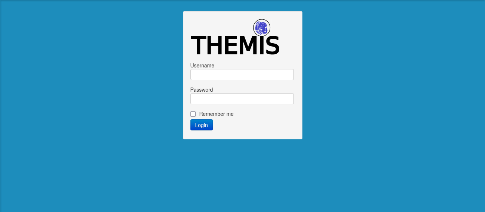

## CLOUD APPLICATION SERVER

Use the [application server](https://emoncms.ddns.net/try) to launch a container

## DOCKER

**The recommanded way for Themis is to run as a set of docker containers.**

Please get in touch if you want a full system !

You can test the monitoring container on 3 architectures : `amd64`, `armv7` and `arm64`/`aarch64`

You can run it on windows with WSL (Windows Subsystem for Linux) installed and [docker desktop](https://www.docker.com/products/docker-desktop/)

```
docker pull alexjunk/emoncms
```

More on :
- [docker hub](https://hub.docker.com/r/alexjunk/emoncms)
- [https://emoncms-docker.github.io](https://emoncms-docker.github.io)

## LEGACY : download and burn on SD

date | link
--|--
23/06/2022 | [Themis Bios - 16 Gb cards - linux kernel 5.15.32](https://drive.google.com/u/0/uc?id=1874vnJTrYKGkXykJvVuVlcXoWIYOKLQI&export=download)<br><br>[release notes](release_notes.txt)

check the release notes for all details about versioning and SHA256

Use xz to extract :

```
xz -d -v file_name.img.xz
```
Run `sudo apt install xz-utils` to install xz on debian/ubuntu



### resizing partitions

**If using a 32 Gb card, use [gparted](https://gparted.org/) to extend filesystem**

The process is quite straightforward, and gparted will make all moving and resizing operations easy

### first steps

If you have a Themis machine, checkout [how to replace the SD](Themis_change_SD) 

If you don't have a Themis machine, insert the SD in a raspberry PI3 (or 4), connect to your internet box and boot, that's all...

Assuming the raspberry is attributed the address 192.168.1.37, browse `http://192.168.1.37` to access to THEMIS with this legacy version



To access to NodeRED (if preinstalled on the image), browse `https://192.168.1.37:1880`
