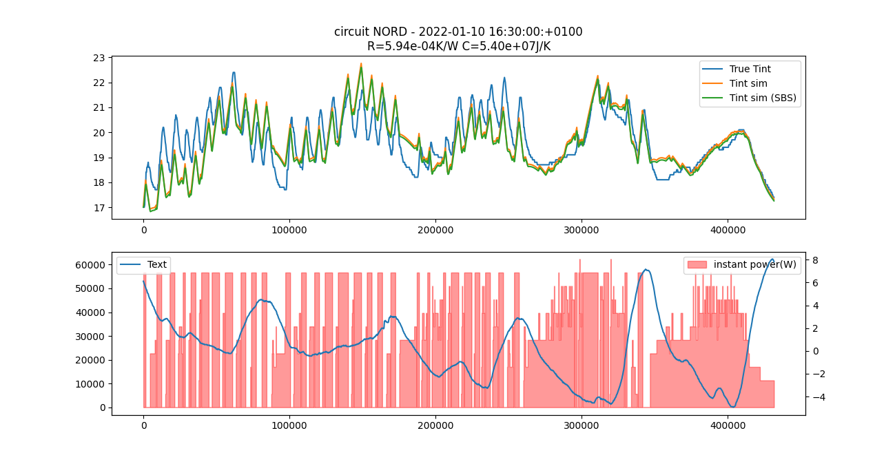

We decided in 2018 to test the Batisense solution, a prediction solution developed by the Probayes company, that schematizes the building as a set of electrical/thermal circuits in order to model its behavior. From an operational point of view, using a model from the cloud to manage distribution on the field is not that easy because it has to be recalibrated constantly.

Below is represented a R3C2 model, which requires a data commonly unavailable in practice: the wall temperature of the building

Patents registered on this subject can be found on epo.org :
[EP3291033A1](https://worldwide.espacenet.com/patent/search/family/057209577/publication/EP3291033A1)
 and 
[EP2781976A1](https://worldwide.espacenet.com/patent/search/family/048656084/publication/EP2781976A1)

The R1C1 model is less complicated to implement and still representative of the thermal behavior of a building. To proceed to optimizations, it only requires data easily available with current technologies: indoor and outdoor temperatures, instantaneous heating power. 

[More information and python codes related to the R1C1 model](https://github.com/Open-Building-Management/RCmodel)

The following diagram results from an optimization carried out with the `minimize` algorithm from the scipy library using the [BFGS method](https://en.wikipedia.org/wiki/Broyden%E2%80%93Fletcher%E2%80%93Goldfarb%E2%80%93Shanno_algorithm).

The blue curve is the field thruth, the green one is the simulation.
