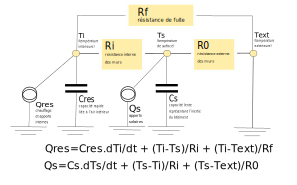

We decided in 2018 to test the Batisense solution, a prediction solution developed by the Probayes company, that schematizes the building as a set of electrical/thermal circuits in order to model its behavior.

Below is represented a R3C2 model, which requires a data commonly unavailable in practice: the wall temperature of the building

Patents registered on this subject can be found on epo.org :
[EP3291033A1](https://worldwide.espacenet.com/patent/search/family/057209577/publication/EP3291033A1)
 and 
[EP2781976A1](https://worldwide.espacenet.com/patent/search/family/048656084/publication/EP2781976A1)

From an operational point of view, using a model from the cloud to manage distribution on the field is not that easy because it has to be recalibrated constantly.

