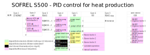
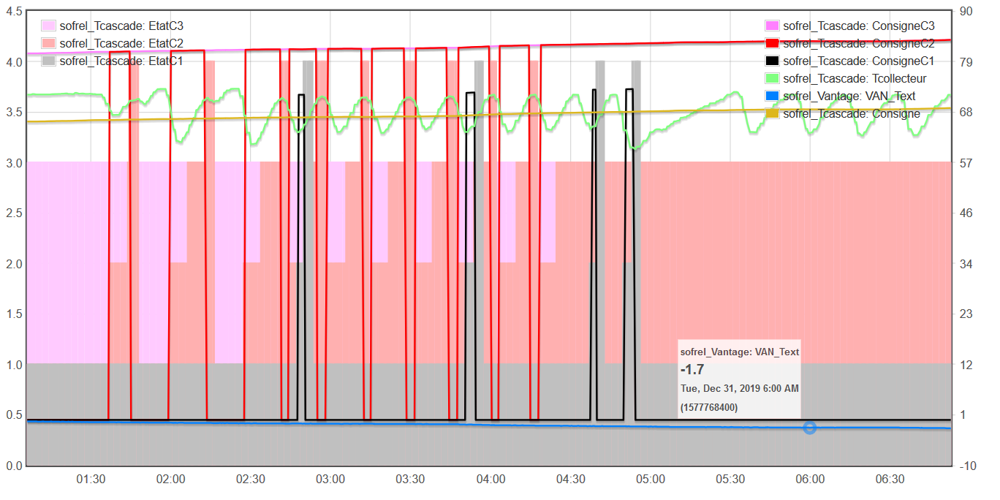
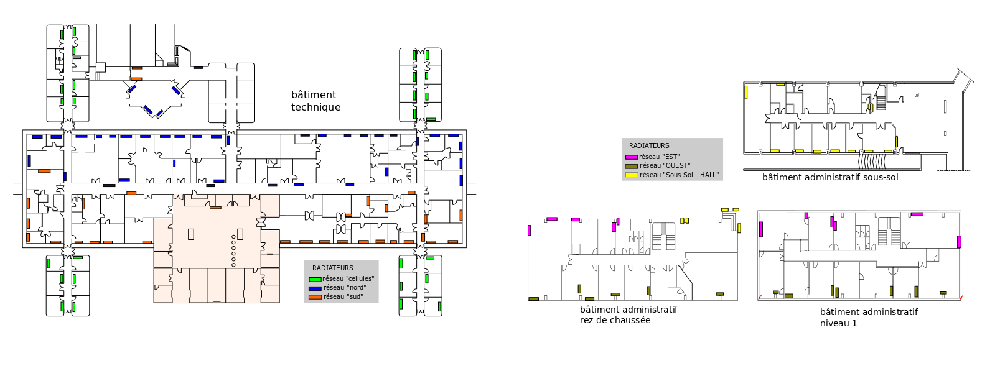
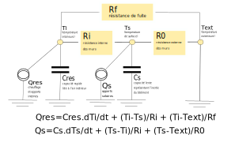
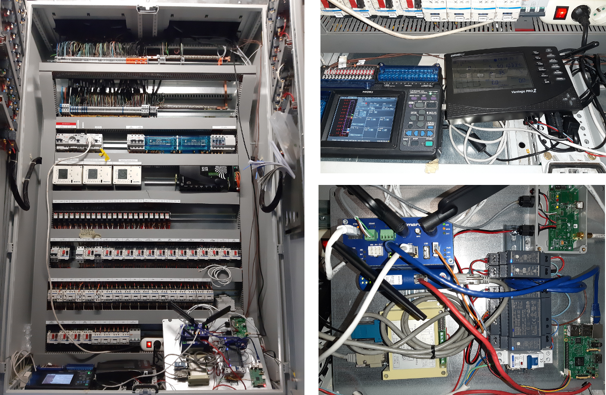
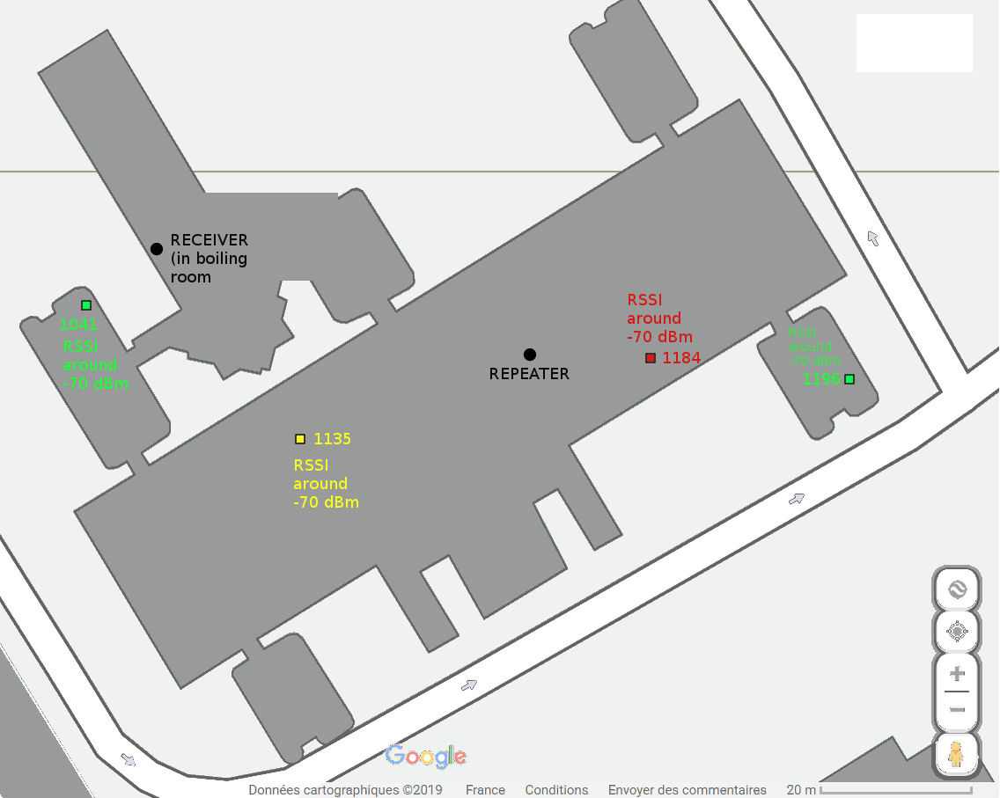

## History and organisation

The boiler room is organized around three deprecated TOTALTUB boilers not insulated but fully working.

The room supplies 6 hot water circuits, each using a a 3-way valve and a pump for regulation.


The building heated by this boiler room dates from the 1970/80s, with no insulation, a large number of metal doors and a roof seal to be reworked. The refurbishment of the boiler room is therefore far from being a priority.

Around 2005, a Sofrel s500 PLC had been installed as a modbus master for the 3 Sauter EQJ controllers, each one managing 2 hot water circuits.

PLC : {{site.data.glossary.PLC}}

Even though there is a specific software named Softools to control the PLC, it can be easily queried and configured in TCPIP, via its ethernet port, using the modbus TCP mode. 
The Softools software is only necessary to program the device from scratch, and once programming is done, you can network it freely, which is essential for interoperability. 
This is valid with all modbus TCP hardware.

### Production optimization

During the year 2017, a Davis vantage weather station was connected to the Sofrel, as the temperature sensors associated with the Sauter controllers seemed overly optimistic during intense cold spells.

At that time, the Themis project was still very young and had not yet adopted the 169 mhz Enless sensors to measure outdoor and indoor temperatures.

In retrospect, it would have been easiest and cheaper to install a single sensor than a complete weather station.

Anyway, we had a Davis vantage weather station, a 868Mhz radio device coming with a [modbus RS485 bridge](manuel_6537_F_ver10ct.pdf) which we decide to translate 
in modbus IP via a [HMS AB7007 Anybus gateway](https://www.anybus.com/fr/support/file-doc-downloads/communicator-specific/?ordercode=AB7007), for easy integration into the Sofrel S500. The Davis vantage was defined as a slave device (or external PLC) within the S500.

As the Sofrel was powerful enough to also regulate the hot water production within the primary collector, a software cascade was implemented at the beginning of the 2017/2018 winter season.
In order to achieve this, new modulating burners were installed on the boilers, that can be controlled by a 0/10V or 4/20 mA analog signal.



With a new PID onboard, the Sofrel was now able to supervise the production of hot water, the global energy efficiency of the boiler room being really enhanced.



2018 was the first year in which we actually saved Kwh and money. It was a great improvment for us.
Anyway, the functioning of the circuits was far from optimal and it is still very hard to heat the building properly...


### Circuits supply optimization

Tipically, the water temperature in each circuit is defined by the Sauter controllers using a linear function of the outdoor temperature, measured by wired sensors.

Ext T	|Start Tcell|	Start Tnord	|Start Tsud|	Start Tsshall|Start Test|Start Touest
--|--|--|--|--|--|--
20|30|20|20|20|20|20					
-10|85|75|67|55|70|67

All temperature are expressed in °C.

The cell circuit (in green on the following map) is the most difficult to regulate, being too long, not insulated and supplying prefabricated offices from the 80s that were quickly added to the laboratory building.





The circuits regulation was traditionally achieved with night and weekend "reductions", which is a very common practise in the world of heating engineers.... For a building with no inertia and very little insulation, this method is not effective and the comfort in the building is absolutely zero. With a well-insulated building, these so called "reductions" can be OK but they are not the best way to save energy.

In order to improve things, we decided in 2018 to test the Batisense solution, an artificial intelligence developed by the Probayes company, that schematizes the building as a set of electrical/thermal circuits in order to model its behavior. 



Patents registered on this subject can be found on epo.org :
[EP3291033A1](https://worldwide.espacenet.com/patent/search/family/057209577/publication/EP3291033A1)
 and 
[EP2781976A1](https://worldwide.espacenet.com/patent/search/family/048656084/publication/EP2781976A1)

The implementation of Batisense with its long-range indoor comfort sensors (169 Mhz) was a very exciting experience. As far as the cell cicuit was concerned, we suspected it was very necessary to keep a "full" heating during the night when it was cold outside, because we had the intuition that the building was losing too much warm and that the energy distribution system was not enough powerful to make up for it. But we couldn't put this into practice. Batisense allowed us to carry things dynamically, optimizing the cut-off periods and taking into account the building's capacities.

### Starting deep-learning

By the end of 2019, we decided to install a complete monitoring separate from Batisense, which is patented and not really designed to exchange data in a 'opensource' manner. The aim is to collect a dataset to test our own deep-learning algorithms.

Using a specially modified themis machine, we decided to duplicate the instrumentation for the extra sensors installed by the Probayes (indoor temperature, return temperature in the circuits)...

Themis is basically a TCPIP network organized around a nanocomputer and using a 4G router for remote maintenance. The routeur has got a full DHCP server managing all connected TCPIP devices. It was therefore very easy to interface a Sofrel PLC to Themis. To record in real time the circuits temperature, as we had a spare [HIOKI datalogger](Themis_fluid_T_mes.html), not mobilized in the field, we just drop some thermocouples, easy to deploy....





For indoor temperature monitoring, Themis is using the same kind of sensors as Batisense, i.e. [Enless 169 Mhz wireless Mbus sensors](TRH_recording.html) and we had to deploy two 169 Mhz in the boiler room.



The structure of the building being very unfavourable to the propagation of radio waves (many walls and metal beams), a repeater was installed in order to guarantee a correct quality (RSSI close to -70 dBm almost everywhere).




## Anybus AB7007

[Anybus Communicator Manager (ACM)](hms-scm-1204-169.zip)

in order to get the mac address of the module, once connected to a network with 192.168.4.3 as IP address, open a telnet session `telnet 192.169.4.3` and issue the command `version`

```
HMS AnyBus-S Ethernet module
Admin mode, no login required

\> version
HMS AnyBus-S Ethernet module

Software version:   3.03.01
Bootloader version: 2.00.02
Serial number:      0xA0340CD9
MAC address:        00-30-11-1D-C9-2E
FB type:            0x0083

\>

```

9600 bit/s
, 8 databits
, Parity : none
, stopbits : 1
, RS232

### Anybus IPconf for operation with smartflex


### Anybus node configuration for VANTAGE interrogation


### Anybus configuration files

[cfg+cfx files for Anybus 7007 - operation on themis machine DLCF boiler room - 10/12/2019](VANTAGE_HMS_10_12_2019.zip)


## Sofrel S500

...

