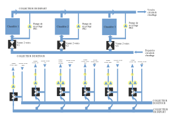

## History and organisation

The boiler room is organized around three deprecated TOTALTUB boilers not insulated but fully working.

The room supplies 6 hot water circuits, each using a a 3-way valve and a pump for regulation.



The building heated by this boiler room dates from the 1970/80s, with no insulation, a large number of metal doors and a roof seal to be reworked. The refurbishment of the boiler room is therefore far from being a priority.

Around 2005, a Sofrel s500 PLC had been installed as a modbus master for the 3 Sauter EQJ controllers, each one managing 2 hot water circuits.

PLC : {{site.data.glossary.PLC}}

Even though there is a specific software named Softools to control the PLC, it can be easily queried and configured in TCPIP, via its ethernet port, using the modbus TCP mode. 
The Softools software is only necessary to program the device from scratch, and once programming is done, you can network it freely, which is essential for interoperability. 
This is valid with all modbus TCP hardware.

### Production optimization

During the year 2017, a Davis vantage weather station was connected to the Sofrel, as the temperature sensors associated with the Sauter controllers seemed overly optimistic during intense cold spells. The Davis vantage being a 868Mhz radio device streaming to a modbus RTU receiver, the connection was achieved using an Anybus AB7007 RTU to TCP converter, and the Davis vantage was defined as a slave device (or external PLC) within the Sofrel.

At that time, the Themis project was still very young and had not yet adopted the 169 mhz Enless sensors to measure outdoor and indoor temperatures.

In retrospect, it would have been easiest and cheaper to install a single sensor than a complete weather station.

As the Sofrel was powerful enough to also regulate the hot water production within the primary collector, a software cascade was implemented at the beginning of the 2017/2018 winter season.
In order to achieve this, new modulating burners were installed on the boilers, that can be controlled by a 0/10V or 4/20 mA analog signal. 
With a new PID onboard, the Sofrel was now able to supervise the production of hot water, the global energy efficiency of the boiler room being really enhanced.
2018 was the first year in which we actually saved Kwh and money. It was a great improvment for us.
Anyway, the functioning of the circuits was far from optimal and it is still very hard to heat the building properly...


### hot water circuits supply optimization

Traditionnaly, the water temperature in each circuit is defined by the Sauter controllers using a linear function of the outdoor temperature, measured by wired sensors.

Ext T	|Start Tcell|	Start Tnord	|Start Tsud|	Start Tsshall|Start Test|Start Touest
--|--|--|--|--|--|--
20|30|20|20|20|20|20					
-10|85|75|67|55|70|67

All temperature are expressed in °C.

The so-called cell circuit is the most difficult to regulate, being too long, not insulated and supplying prefabricated offices from the 80s that were quickly added to the laboratory building.



Themis is basically a TCPIP network organized around a nanocomputer and using a 4G router for remote maintenance. The routeur has got a full DHCP server managing all connected TCPIP devices. It is therefore very easy to interface a Sofrel PLC to Themis.




## Anybus AB7007
https://www.anybus.com/fr/support/file-doc-downloads/communicator-specific/?ordercode=AB7007

[Anybus Communicator Manager (ACM)](hms-scm-1204-169.zip)

in order to get the mac address of the module, once connected to a network with 192.168.4.3 as IP address, open a telnet session `telnet 192.169.4.3` and issue the command `version`

```
HMS AnyBus-S Ethernet module
Admin mode, no login required

\> version
HMS AnyBus-S Ethernet module

Software version:   3.03.01
Bootloader version: 2.00.02
Serial number:      0xA0340CD9
MAC address:        00-30-11-1D-C9-2E
FB type:            0x0083

\>

```

9600 bit/s
, 8 databits
, Parity : none
, stopbits : 1
, RS232

### Anybus IPconf for operation with smartflex


### Anybus node configuration for VANTAGE interrogation


### Anybus configuration files

[cfg+cfx files for Anybus 7007 - operation on themis machine DLCF boiler room - 10/12/2019](VANTAGE_HMS_10_12_2019.zip)


## Sofrel S500

...

