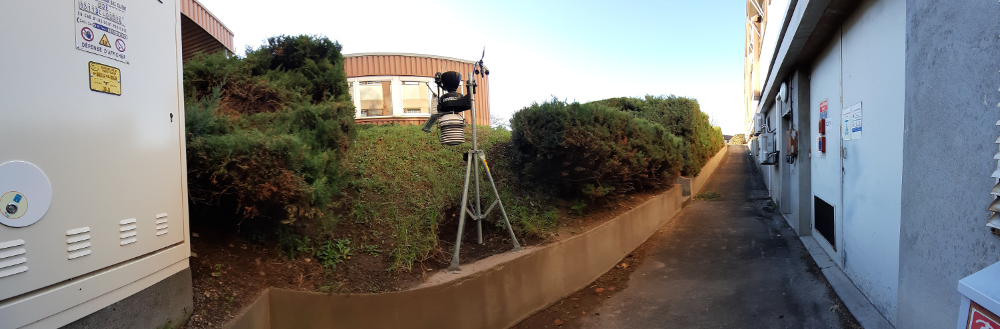
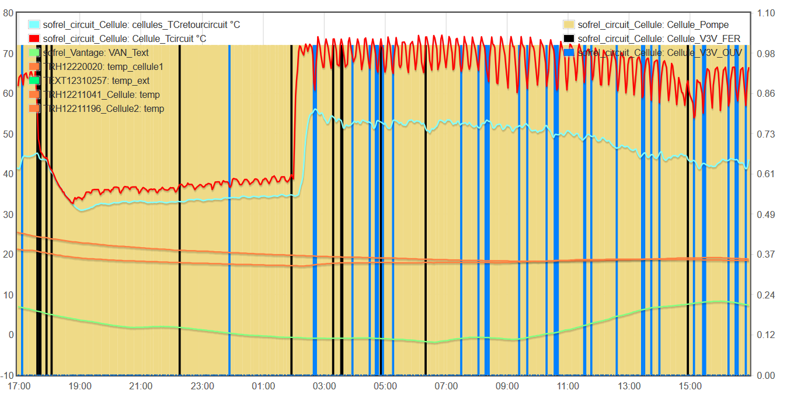
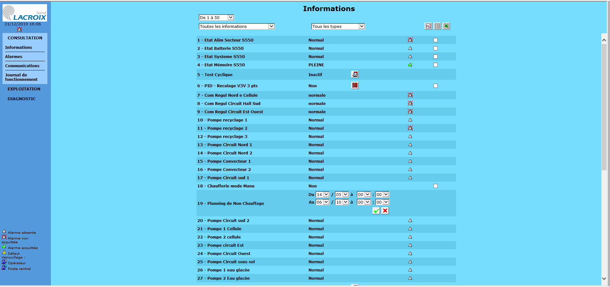

The setup below can be frightening, but this is usually what happens in practice when you deploy different brands of equipment with gateways in all directions to allow data exchange.


## History and organisation

The boiler room is organized around three deprecated TOTALTUB boilers not insulated but fully working.

The room supplies 6 hot water circuits, each using a a 3-way valve and a pump for regulation.


The building heated by this boiler room dates from the 1970/80s, with little insulation, a large number of metal doors and a roof seal to be reworked.

Around 2010, a Sofrel s500 PLC had been installed to control the boilers, but its configuration has not been properly achieved.

PLC : {{site.data.glossary.PLC}}

Even though there is a specific software named Softools to control the PLC, it can be easily queried and configured in TCPIP, via its ethernet port, using the modbus TCP mode. 
The Softools software is only necessary to program the device from scratch, and once programming is done, you can network it freely, which is essential for interoperability. 
This is valid with all modbus TCP hardware.

## Outdoor temperature monitoring

During the year 2017, a Davis vantage weather station was connected to the Sofrel, as the original temperature sensors of the boiler room seemed overly optimistic during intense cold spells.



The outdoor temperature monitored by a sensor fixed on the wall of the building is different from the outdoor temperature that can be monitored by the "open field" sensor of a meteostation. The sensor on the building benefits from the heat of the building. In a meteostation, the sensor is protected and should represent the real outdoor temperature, not a temporary "heat" feeling. 
Anyway, it can make sense to control a circuit serving a south wing with an outdoor temperature sensor positioned on the south wall, and to control a circuit serving a north wing with an outdoor temperature sensor positioned on the north wall. Same with east and west...

The Davis vantage weather station is a 868Mhz radio device coming with a [modbus RS485 bridge](manuel_6537_F_ver10ct.pdf) which we connected to the RS485 bus of Themis/BIOS. As Themis/BIOS can act as a modbus forwarding server, thanks to pymodbus3, all datas coming from the weather station can be easily routed to the Sofrel S500. You just need to define Themis/BIOS as an external PLC within the S500 and to specify the registers to query.


## Production optimization

A software cascade was implemented on the Sofrel at the beginning of the 2017/2018 winter season.
In order to achieve this, new modulating burners were installed on the boilers, that can be controlled by a 0/10V or 4/20 mA analog signal.


With a new PID onboard, the Sofrel was now able to supervise the production of hot water, the global energy efficiency of the boiler room being really enhanced.


2018 was the first year in which we actually saved Kwh and money. It was a great improvment for us.
Anyway, the functioning of the circuits was far from optimal and it is still very hard to heat the building properly...


## Circuits supply optimization

Tipically, the temperature of hot water injected in each circuit follows a linear function of the outdoor temperature, measured by wired sensors.

```
water_t : injected water temperature in °C
t_c : indoor setpoint temperature in °C
t_ext : outdoor measured temperature in °C
pente : slope of the linear function - 1.5 is a common value

water_t = pente * (t_c - t_ext) + t_c
```

Therefore, if you want to maintain an indoor temperature of 20°C, the theory is that the circuit temperature has to follow the above water law :
```
water_t = 1.5 * (20 - t_ext) + 20
```

The cell circuit (in green on the following map) is the most difficult to regulate, being too long, not insulated and supplying prefabricated offices from the 80s that were quickly added to the laboratory building : tin walls, no crawl space, improperly sized heaters.


In poorly isolated buildings, the regulation is traditionally achieved with night and weekend "reductions", which is a very common practise in the world of heating engineers....

The reduction acts as a layer of insulation, which you decide to activate when outdoor temperature is below a specific threshold.

All of this involves setting a set point temperature for reduced operation, e.g. 15 or 10 °C, and the value of the outdoor temperature below which the process is triggered, e.g. 8 °C

When the building is empty and when the measured outdoor temperature or when the predicted outdoor temperature for the next 24 hours goes down under 8°C, the system starts to distribute water :
```
water_t = 1.5 * (10- t_ext) + 10
```

If you want to control the efficiency of the settings implemented in the water laws, you need to deploy indoor temperature sensors. 
A convenient solution is to use the long-range indoor comfort sensors (169 Mhz) associated to Themis, i.e. [Enless 169 Mhz wireless Mbus sensors](TRH_recording.html)

In pour case, the structure of the building being very unfavourable to the propagation of radio waves (many walls and metal beams), a repeater was installed in order to guarantee a correct quality (RSSI close to -70 dBm almost everywhere).


When you engage such an instrumentation, you start to notice that a particular circuit has significant hydraulic imbalances, 
that there is a 3 degrees difference between the side of the circuit closest to the boiler room and the one furthest away, 
that some heaters are not working properly and that the valves of the thermostatic heads are seized. 
In short, you start to re-adjust everything, but all this is long and laborious. 
Digital technology does not solve anything, it only helps to identify the problems and to prioritize the concrete actions to be carried out. 


## Collecting datasets...

By the end of 2019, we decided to install a complete monitoring separate from Batisense, which is patented and not really designed to exchange data in a 'opensource' manner. The purpose of this second monitoring is to collect a full dataset to train a neural network in a reinforcement-learning manner.

Using a specially modified themis machine, we decided to duplicate the instrumentation for the extra sensors installed by the Probayes (indoor temperature, return temperature in the circuits)...

Themis is basically a TCPIP network organized around a nanocomputer, using a 4G router for remote maintenance. The routeur has got a full DHCP server managing all connected TCPIP devices. It was therefore very easy to interface a Sofrel PLC to Themis. To record in real time the circuits temperature, as we had a spare [HIOKI datalogger](Themis_fluid_T_mes.html), not mobilized in the field, we just drop some thermocouples, easy to deploy....




For each circuit, the monitoring provides the following data :
- water temperature at injection point
- water temperature after heating
- indoor temperature in the zone heated by the circuit
- outside temperature
- 3-way valve status (opened/closed)
- pump status (on/off)



The water flow rates (in m3/h) are constant for each circuit and have been measured with an ultrasonic flowmeter

Cellules|Nord|Sous-sol|Sud|Est|Ouest
--|--|--|--|--|--
5.19|6.5|4.2|2.6|1.38|1.1


## Sofrel S500



[SOFREL backup file to recreate the configuration](S500_10_12_2019.ica)

[SOFREL registers list](registres_modbus_afterEICwork.ods)
