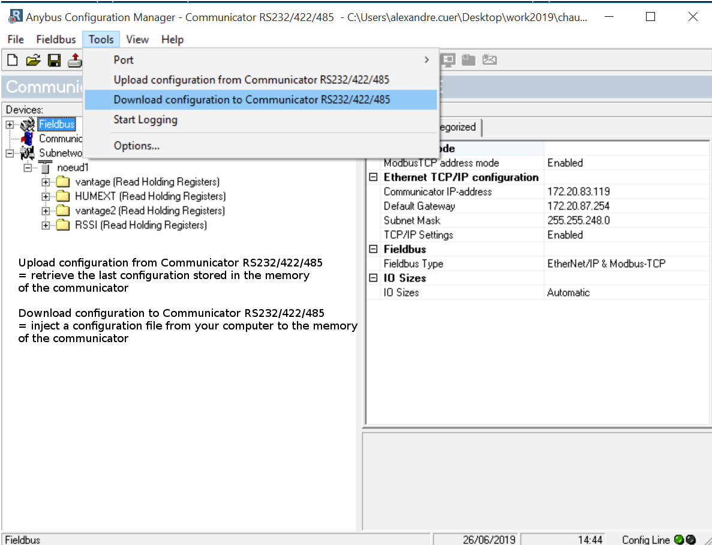

The boiler room is organized around three deprecated 
total hub boilers not insulated but fully working.
Around 2005, a Sofrel s500 PLC had been installed as a modbus master for the 3 Sauter EQJ controllers, each one managing 2 hot water circuits. 
The Sofrel is powerful enough to also regulate the production within the primary collector, via a software cascade.
In order to achieve this, the boilers have recently been equipped with new modulating burners that can be controlled by a 0/10V analog signal.

## Anybus AB7007
https://www.anybus.com/fr/support/file-doc-downloads/communicator-specific/?ordercode=AB7007

[Anybus Communicator Manager (ACM)](hms-scm-1204-169.zip)

in order to get the mac address of the module, once connected to a network with 192.168.4.3 as IP address, open a telnet session `telnet 192.169.4.3` and issue the command `version`

```
HMS AnyBus-S Ethernet module
Admin mode, no login required

\> version
HMS AnyBus-S Ethernet module

Software version:   3.03.01
Bootloader version: 2.00.02
Serial number:      0xA0340CD9
MAC address:        00-30-11-1D-C9-2E
FB type:            0x0083

\>

```

9600 bit/s
, 8 databits
, Parity : none
, stopbits : 1
, RS232

### Anybus IPconf for operation with smartflex


### Anybus node configuration for VANTAGE interrogation


### Anybus configuration files

[cfg+cfx files for Anybus 7007 - operation on themis machine DLCF boiler room - 10/12/2019](VANTAGE_HMS_10_12_2019.zip)



## Sofrel S500

...

