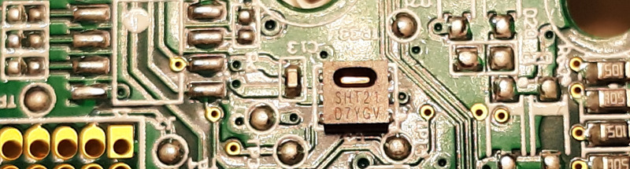
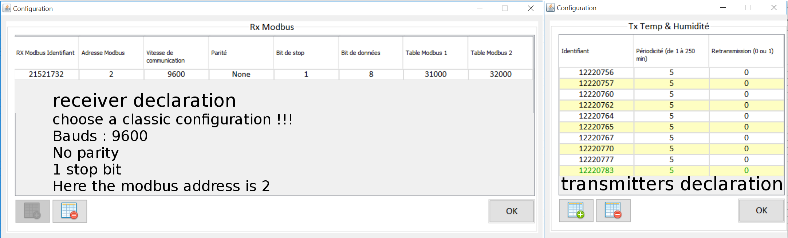
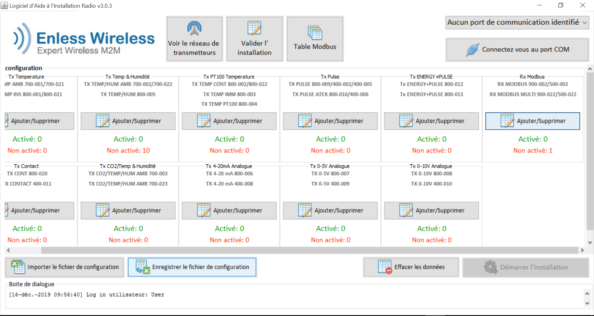
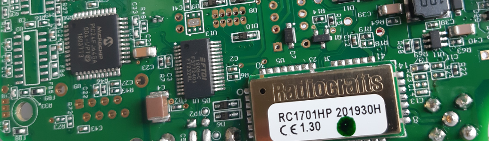
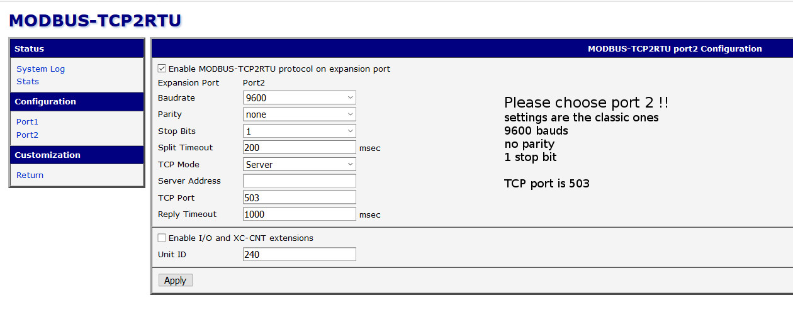
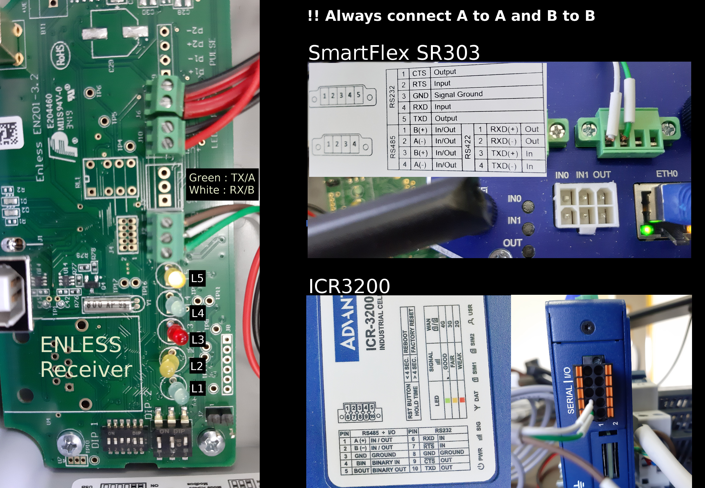
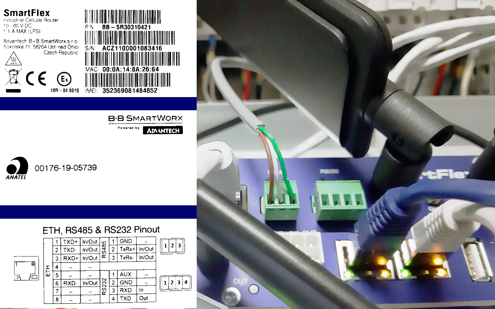



For ambiant temperature and humidity measurement, Themis uses the Enless 169 Mhz sensors - TX TEMP HUM AMB 700-022.

They embed a [SHT21](https://www.sensirion.com/en/environmental-sensors/humidity-sensors/humidity-temperature-sensor-sht2x-digital-i2c-accurate/)
manufactured by [Sensirion](https://www.sensirion.com/en/)



[SHT21 datasheet](Sensirion_Humidity_Sensors_SHT21_Datasheet.pdf)

The Enless toolkit consists of a set of temperature and humidity transmitters plus a receiver

To operate this wireless ecosystem, it is necessary to pair the receiver with the sensors.

Once the pairing has been successfully completed, the datas from the various transmitters are available in real time, via a simple query of the receiver in Modbus RTU format

## Create the ecosystem

Once you receive the receiver and its transmitters, use the Enless Field software [AIR](https://enless-wireless.com/ressources/Enless%20Field%20Installation.zip) to create the ecosystem



Assuming you are using a windows 10 machine and even if your machine is 64 bits but a bit old :
- install the [32 bits version](https://javadl.oracle.com/webapps/download/AutoDL?BundleId=240726_5b13a193868b4bf28bcb45c792fce896) of the [jre](https://www.java.com/fr/download/manual.jsp)
- install the 32 bits of AIR

At this stage, you do not need to have the hardware connected to the computer on which the software is installed





Save the csv file (smart if you need to change the periodicity in the future)

[example](ThemisStrasbourg.csv)

## Pairing process

### Phase 1 : transmitters installation




On the receiver, position the switches as follow :
- DIP1 : 1,2,3,4 OFF **5,6 ON**
- DIP2 : 1,2,3 OFF
    
Power the receiver with a 12V alimentation



Plug the receiver to the computer via USB

Load the csv file if needed

Connect to the receiver 

```
[15-déc.-2019 20:14:47] Port série connecté COM9@19200
```

Start the installation
```
[07-janv.-2020 16:24:28] Démarrage de l’installation
```

Power one by one each transmitter
```
[07-janv.-2020 16:24:36] Demande d'installation pour TX TEMP HUM 12220756 RSSI:-28,0dBm
[07-janv.-2020 16:24:38] Acquittement en phase d'installation 12220756 RSSI:-27,0dBm
[07-janv.-2020 16:24:39] Niveau RSSI en phase d'installation 12220756 RSSI:-29,0dBm
[07-janv.-2020 16:24:41] Niveau RSSI en phase d'installation 12220756 RSSI:-27,0dBm
[07-janv.-2020 16:24:43] Niveau RSSI en phase d'installation 12220756 RSSI:-28,0dBm
[07-janv.-2020 16:24:45] Niveau RSSI en phase d'installation 12220756 RSSI:-41,0dBm
[07-janv.-2020 16:24:47] Niveau RSSI en phase d'installation 12220756 RSSI:-40,0dBm
[07-janv.-2020 16:24:49] Succès de l'installation TX TEMP HUM 12220756 RSSI:-38,0dBm
```

On each transmitter, L1 should blink in red during communication with receiver









Stop the installation
```
[07-janv.-2020 16:42:24] Arrêter l’installation
```
The sensors should now appear as activated

### Phase 2 : receiver installation and pairing with transmitters

Unplug and poweroff the receiver

On the receiver, position the switches as follow :
- DIP1 : 1,2,3,4 OFF **5,6 ON**
- DIP2 : 1,3 OFF **2 ON**

Power the receiver with a 12V alimentation

Once the receiver powered, L5 should start blinking on it



As soon as L5 flashes, don't waste time :
- plug the receiver to the computer via USB, 
- connect the AIR software to the receiver 
- start the installation

```
[07-janv.-2020 16:44:25] Port série connecté COM9@19200
[07-janv.-2020 16:44:30] Démarrage de l’installation
[07-janv.-2020 16:44:32] Demande d'installation pour Receiver 21520922
[07-janv.-2020 16:44:38] Acquittement en phase d'installation Receiver 21520922
[07-janv.-2020 16:44:44] Succès de l'installation Receiver 21520922
```
Stop the installation

```
[07-janv.-2020 16:44:59] Arrêter l’installation
```
The receiver should now appear as activated

### Phase 3 : switching the receiver in RS485 exploitation mode

Unplug and poweroff the receiver

On the receiver, position the switches as follow :
- DIP1 : 1,2,5,6 OFF **3,4 ON**
- DIP2 : 1,2 OFF **3 ON**

### DIP position summary


## Routeur configuration

Tested with [Smarflex SR303](https://www.advantech.com/products/06b15852-9a2d-423e-97ec-d90bd82a5bee/bb-sr30310321/mod_59eeda28-54d1-482c-8d5d-b3c450694242) 
and [ICR3200](https://www.advantech.com/products/7e21d2de-630c-4925-a51c-f41c18642d72/icr-3231/mod_697d4d3b-6001-4b99-9076-e67558296542) from [Advantech](https://www.advantech.com/)






## Physical connexions



The above illustration was made using an ISR 3200 router and a smartflex SR303 router with 2 ethernet ports. There is a variant of the SR303 with 3 ethernet ports. The RS485 connectivity is a bit different.



## Emonhub configuration

### declare the interfacer

```
[interfacers]
[[ModbusTCP]]
    Type = EmonModbusTcpInterfacer2
    [[[init_settings]]]
        modbus_IP = 192.168.1.1 # ip address of client to retrieve data from
        modbus_port = 503 # Portclient listens on
        fCode = 3 # optional if using function code 3 (read holding registers) - with fCode = 4, the interfacer will read input registers
    [[[runtimesettings]]]
        nodeIds = 23,24
        pubchannels = ToEmonCMS,
        # time in seconds between checks, This is in addition to emonhub_interfacer.run() sleep time of .01
        interval = 60
```

### configure some nodes

```
[[23]]
    nodename = TRH12220020
    [[[rx]]]
       names = SlaveType,Timer,RSSI,serHigh,serLow,temp,hum
       registers = 31048,31049,31050,31051,31052,31053,31054
       datacode = H
       scales = 1,1,0.5,1,1,0.1,0.1

[[24]]
    nodename = CO218251004
    [[[rx]]]
        names = SlaveType,Timer,RSSI,serHigh,serLow,co2,temp,hum
        registers = 31092,31093,31094,31095,31096,31097,31098,31099
        datacode = H
        scales = 1,1,0.5,1,1,1,0.1,0.1
```
