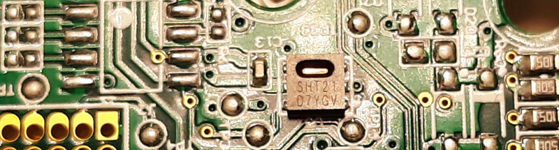

For ambiant temperature and humidity measurement, Themis uses the Enless 169 Mhz sensors - TX TEMP HUM AMB 700-022.

They embed a [SHT21](https://www.sensirion.com/en/environmental-sensors/humidity-sensors/humidity-temperature-sensor-sht2x-digital-i2c-accurate/)
manufactured by [Sensirion](https://www.sensirion.com/en/)



[SHT21 datasheet](Sensirion_Humidity_Sensors_SHT21_Datasheet.pdf)

The Enless toolkit consists of a set of temperature and humidity transmitters plus a receiver

To operate this wireless ecosystem, it is necessary to pair the receiver with the sensors.

Once the pairing has been successfully completed, the datas from the various transmitters are available in real time, via a simple query of the receiver in Modbus RTU format

## Create the ecosystem

Once you receive the receiver and its transmitters, use the [Enless Field software](https://enless-wireless.com/ressources/Enless%20Field%20Installation.zip) to create the ecosystem

At this stage, you do not need to have the hardware connected to the computer on which the software is installed


Save the csv file (smart if you need to change the periodicity in the future)

[example](ThemisStrasbourg.csv)

## Pairing process

### Phase 1 : transmitters installation

On the receiver, position the switches as follow :
- DIP1 : 1,2,3,4 OFF **5,6 ON**
- DIP2 : 1,2,3 OFF
    
Power the receiver with a 12V alimentation



Plug the receiver to the computer via USB

Load the csv file if needed

Connect to the receiver 

```
[15-déc.-2019 20:14:47] Port série connecté COM9@19200
```

Start the installation

Power one by one each transmitter

On each transmitter, L1 should blink in red during communication with receiver









Stop the installation

The sensors should now appear as activated

### Phase 2 : receiver installation and pairing with transmitters

Unplug and poweroff the receiver

On the receiver, position the switches as follow :
- DIP1 : 1,2,3,4 OFF **5,6 ON**
- DIP2 : 1,3 OFF **2 ON**

Power the receiver with a 12V alimentation

Plug the receiver to the computer via USB

Connect to the receiver

Start the installation

```
bla bla
```
Stop the installation

The receiver should now appear as activated

### Phase 3 : switching the receiver in RS485 exploitation mode

Unplug and poweroff the receiver

On the receiver, position the switches as follow :
- DIP1 : 1,2,5,6 OFF **3,4 ON**
- DIP2 : 1,2 OFF **3 ON**

### DIP position summary


## Routeur configuration

Tested with [Smarflex SR303](https://www.advantech.com/products/06b15852-9a2d-423e-97ec-d90bd82a5bee/bb-sr30310321/mod_59eeda28-54d1-482c-8d5d-b3c450694242) 
and [ICR3200](https://www.advantech.com/products/7e21d2de-630c-4925-a51c-f41c18642d72/icr-3231/mod_697d4d3b-6001-4b99-9076-e67558296542) from [Advantech](https://www.advantech.com/)




## Physical connexions


## Emonhub configuration

```
[interfacers]
[[ModbusTCP]]
    Type = EmonModbusTcpInterfacer2
    [[[init_settings]]]
        modbus_IP = 192.168.1.1 # ip address of client to retrieve data from
        modbus_port = 503 # Portclient listens on
        fCode = 3 # optional if using function code 3 (read holding registers) - with fCode = 4, the interfacer will read input registers
    [[[runtimesettings]]]
        nodeIds = 23,24
        pubchannels = ToEmonCMS,
        # time in seconds between checks, This is in addition to emonhub_interfacer.run() sleep time of .01
        interval = 60
```

node configuration

```
[[23]]
    nodename = TRH12220020
    [[[rx]]]
       names = SlaveType,Timer,RSSI,serHigh,serLow,temp,hum
       registers = 31048,31049,31050,31051,31052,31053,31054
       datacode = H
       scales = 1,1,0.5,1,1,0.1,0.1

[[24]]
    nodename = CO218251004
    [[[rx]]]
        names = SlaveType,Timer,RSSI,serHigh,serLow,co2,temp,hum
        registers = 31092,31093,31094,31095,31096,31097,31098,31099
        datacode = H
        scales = 1,1,0.5,1,1,1,0.1,0.1
```

Please note :
- register values are 1 more than the values indicated in the Enless datasheet.
Some manufacturers practice an addition of 1, others not like Enless and it is difficult to make a common rule
- RSSI is divided by 2
- Enless is using function code 3
- For nodes, define numbers over 20 so you can use the standard emonhub configuration for electricity monitoring without modifcation
