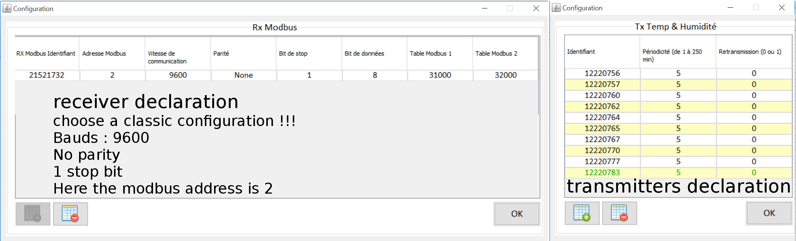
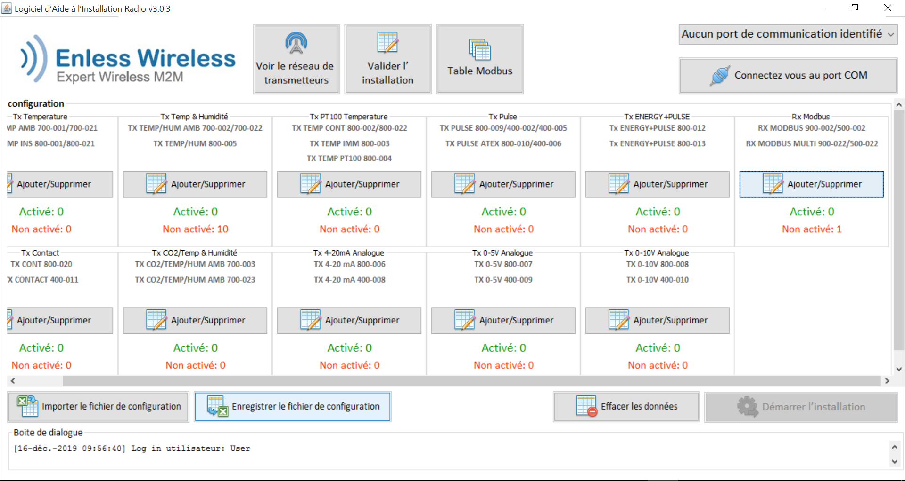

For ambiant temperature and humidity measurement, Themis uses the Enless 169 Mhz sensors - TX TEMP HUM AMB 700-022.

They embed a [SHT21](https://www.sensirion.com/en/environmental-sensors/humidity-sensors/humidity-temperature-sensor-sht2x-digital-i2c-accurate/)
manufactured by [Sensirion](https://www.sensirion.com/en/)

[SHT21 datasheet](Sensirion_Humidity_Sensors_SHT21_Datasheet.pdf)

The Enless toolkit consists of a set of temperature and humidity transmitters plus a receiver

To operate this wireless ecosystem, it is necessary to pair the receiver with the sensors.

Once the pairing has been successfully completed, the datas from the various transmitters are available in real time, via a simple query of the receiver in Modbus RTU format

## Create the ecosystem

Once you receive the receiver and its transmitters, use the [Enless Field software](https://enless-wireless.com/ressources/Enless%20Field%20Installation.zip) to create the ecosystem

At this stage, you do not need to have the hardware connected to the computer on which the software is installed



Save the csv file (smart if you need to change the periodicity in the future)



## Pairing process

### transmitters installation

On the receiver, position the switches as follow :
- DIP1 : 1,2,3,4 OFF 5,6 ON
- DIP2 : 1,2,3 OFF
    
Power the receiver with a 12V alimentation



Plug the receiver to the computer via USB

Load the csv file if needed

Connect to the receiver 

```
[15-déc.-2019 20:14:47] Port série connecté COM9@19200
```

Start the installation

Power one by one each transmitter

On each transmitter, L1 should blink in red during communication with receiver





Stop the installation

### receiver installation

Unplug and poweroff the receiver

On the receiver, position the switches as follow :
- DIP1 : 1,2,3,4 OFF 5,6 ON
- DIP2 : 1,3 OFF 2 ON

