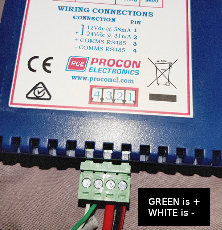
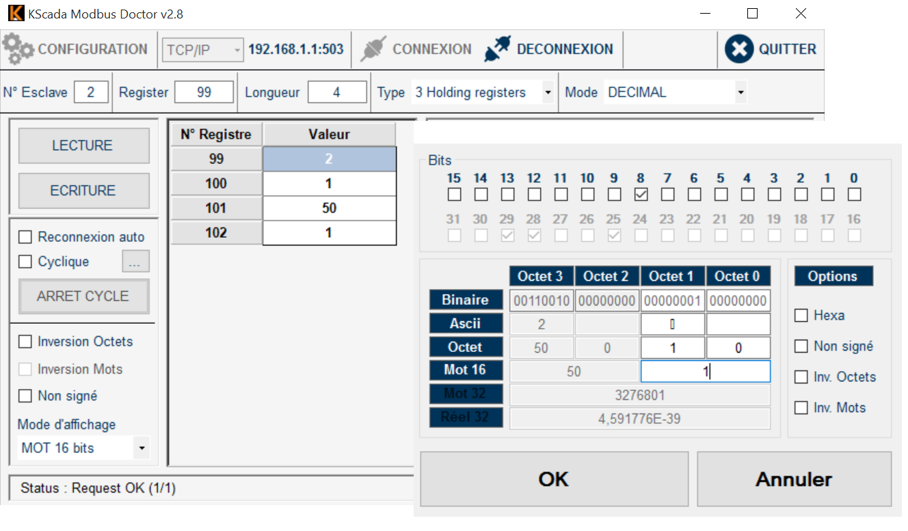
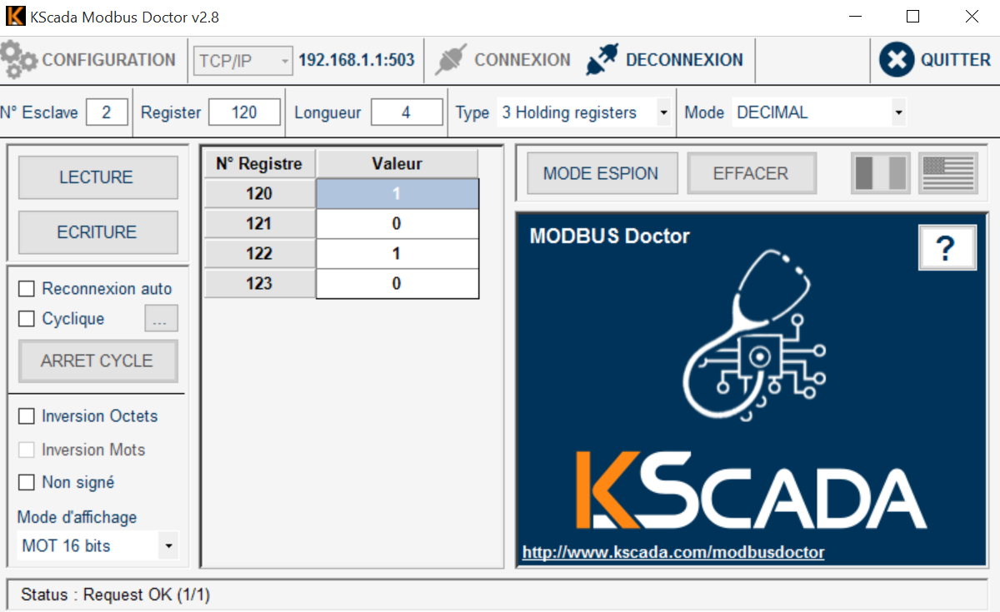

Everything is plug and play on Themis/BIOS but it is smart to share some basic knowledge as far as recording the temperature of a fluide is concerned.

## using modbus devices

A convenient solution is to use a [modbus](http://www.simplymodbus.ca/exceptions.htm) module, such as Promux [PM6RTD](https://www.proconel.com/product/pm6rtd-6-rtd-input-module/)

In a nutshell, keep the factory settings on the PM6RTD : 9600 bauds, 1 stop bit, no parity. 

PM6RTD RS485 terminal block|4|3|2|1
--|--|--|--|--
connector|4-|3+|12V+|GND

Adjust the modbus address with the switches on the front

modbus address|S1|S2|S3
--|--|--|--
1|ON|OFF|OFF
2|OFF|ON|OFF
3|ON|ON|OFF


### RTU mode

Use a USB to serial adapter :
- a very cheap dongle can be found on [reichelt](https://secure.reichelt.com/fr/fr/raspberry-pi-interface-usb-rs485-ch340c-rpi-usb-rs485-p242783.html?search=USB+RS485&&r=1) - no driver required on linux, plug and play
- moxa uport 1150 - [drivers](https://www.moxa.com/en/products/industrial-edge-connectivity/usb-to-serial-converters-usb-hubs/usb-to-serial-converters/uport-1100-series/uport-1150) are required but everything is included in the latest BIOS image.

If making tests using a window desktop, go to the device manager and fit the Moxa so it works in RS485(2W). Here the Moxa appears to be on COM1


promux|4-|3+
--|--|--
cable|white|green
uport 1150|R-(D-)=4|R+(D+)=3



### TCP mode

BIOS can act as a TCP server for a RTU bus connected via USB (serial forwarding mode) but you can also use the RS485 port if using a smartflex or ICR Advantech router.


### basic testing and discover how to configure

Once the promux module powered and connected via RTU or TCP, make a simple test with [modbus doctor](http://www.kscada.com/modbusdoctor.html). Even without any sensor, you can check the serial on register 0. It should be something like 96D (upper byte = software version, here 9, lower byte always = 109 ie 6D) 

The PM6RTD supports various RTD types :

number | RTD Type
--|--
1 | PT100 
2 | Ni120
3 | PT1000
4 | Ni1000 DIN
5 | Ni1000 Landys&Gyr 
6 | Ohms 10 - 400 ohms 
7 | Ohms 100-4000ohms

register number | description
--|--
30001 + 99 | modbus address or unitId 
40001 + 100 | RTD Type 
40001 + 101 | Line Frequency (50/60)
40001 + 102 | Units Type (1=°C, 2=°F)

**register 99 is read only : it's an input register with an offset equal to 30001**

**registers 100, 101 and 102 are read and write : they are called holding registers, with an offset of 40001**

Here is a screen capture for a PM6RTD configured with modbus address 2, PT100 and °C 



if DIP 10 is OFF, communication settings are 9600 bauds, no parity, 1 stop bit

if DIP 10 is ON, communication settings can be programmed :

register number | description
--|--
40001 + 120 | Baud Rate (2400, 4800, 9600, 19200, 38400,57600,115200)
40001 + 121 | Parity (0 = none, 1 = even, 2 = odd)
40001 + 122 | Stop Bits (1 = 1 stop bit, 2 = 2 stop bits) 
40001 + 123 | Reply Delay (0 = Disable, >0 = Enable)



### PT100 wiring


**with the PM6RTD, sensors values can be found from register 1 to 6 (30002 to 30007) **

### thermocouple wiring 

Composition : copper / Constantan (copper + nickel)

From −185 °C to 300 °C ;

accuracy  +/-0,1 °C from −200 °C to 200 °C.

CEI 584-3  
> - brown rubber sheath
> - brown = +
> - white = -

Use the [PM8TC isolated](https://www.proconel.com/product/pm8tc-iso-8-thermocouple-input-module-isolated/) module

**with the PM8TC, sensors values can be found from register 1 to 8 (30002 to 30009) **

## using a TCP datalogger

in case of a demonstrator instrumentation, with a lot of data to record, the HIOKI 8402-20 is a good choice

Using the HIOKI 8402-20 datalogger with a universal analog input unit LR8501

[Hioki web site](https://www.hioki.com/)


Configure the HIOKI 8204 for DHCP and connect it to the smartflex via an ethernet cable

Define a static DHCP lease for the HIOKI, using its MAC address :


use the specific Hioki socket interfacer for emonhub :

```
[[HiokiTCP]]  
    Type = EmonHiokiTcpInterfacer
    [[[init_settings]]]
	    IP = 192.168.2.3
	    port = 8802
    [[[runtimesettings]]]
           pubchannels = ToEmonCMS,
           nodeId = 1
           # in seconds
           interval = 10
```

node configuration

```
[[1]]
    nodename = Hioki8402
    [[[rx]]]
       names = TC1,TC2,TC3
       channels = 1,1,1
       voice = 1,2,3
```

There is no datacode to fix : the HIOKI is streaming ASCII and the decoding is integrated to the interfacer

to understand how to interrogate the HIOKI opening a TCP socket : [python building block](https://github.com/dromotherm/documentation/blob/master/pages/themis/FluidTemp/hioki.py)
