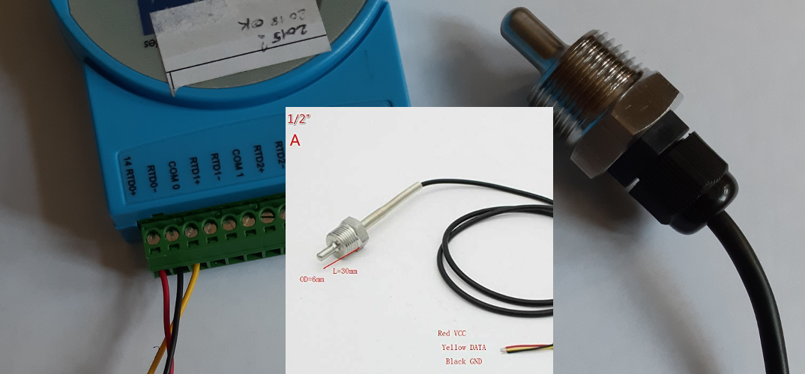

## Using PT 100 and ADAM 4015

### connect PT100 to ADAM4015

Using and ohmmeter, find the wires between which a resistance is present


many PT100 follow a specific color code and you dont need an ohmmeter : 
- red = VCC > RTD+
- black = GND > RTD-
- yelow = DATA > COM


### Configure ADAM4015 for operation on a RS485 network

#### check the moxa configuration

we are using a moxa uport 1150 - [download drivers](https://www.moxa.com/en/products/industrial-edge-connectivity/usb-to-serial-converters-usb-hubs/secure-routers/uport-1000-series#resources)

on a window desktop, go to the device manager and fit the moxa so it works in RS485(2W)


#### Init mode

Booting the ADAM4015 in Init mode can be done by using the specific switch on recent models or by connecting the init terminal to the
GND terminal


connect all the wires on the green terminal block, plug the block in the module, with the switch in INIT mode and power on !

#### Configure with ADAM utility

After the device discovered, fix the address if you have more than 1 element on your modbus network, choose modbus for the protocol, 19.2 Kbps for the baudrate and press update


### connect ADAM4015 to Smartflex

Go back to normal mode and test if communication is OK for example with modbusdoctor

[modbus doctor](http://www.kscada.com/modbusdoctor.html)


### emonhub configuration

create a modbusTCPinterfacer
```
[[ModbusTCP]]
    Type = EmonModbusTcpInterfacer
    [[[init_settings]]]
        modbus_IP = 192.168.1.1
        modbus_port = 503
    [[[runtimesettings]]]
        nodeId = 11
        pubchannels = ToEmonCMS,
        # time in seconds between checks, This is in addition to emonhub_interfacer.run() sleep time of .01
        interval = 10
```

node section example in emonhub :

```
[[11]]
    nodename = PT1000
    [[[rx]]]
       names = CH0,CH1,f1,f2
       registers =1,2,211,212
       datacode = H
       scale = 1
```

for register numbers, check doc on ADAM4015 on Advantech website

parameter |register for emonhub|register for modbusdoctor
--- | ---  | ---
channel 0|1|0
channel 1|2|1
channel 2|3|2
channel 3|4|3
channel 4|5|4
channel 5|6|5
channel 6|7|6
channel 7|8|7
module name 1|211|210 or D2h
module name 2|212|211 or D3h

## Using thermocouple (Seebeck effect)

Type T

Composition : copper / Constantan (copper + nickel)

From −185 °C to 300 °C ;

accuracy  +/-0,1 °C from −200 °C to 200 °C.

CEI 584-3  
> - brown rubber sheath
> - brown = +
> - white = -

Using the HIOKI 8402-20 datalogger with a universal analog input unit LR8501

[Hioki 8402 product page](https://www.hioki.com/en/products/detail/?product_key=5613)


Configure the HIOKI 8204 for DHCP and connect it to the smartflex via an ethernet cable

Define a static DHCP lease for the HIOKI, using its MAC address :


use the specific Hioki socket interfacer for emonhub :

```
[[HiokiTCP]]  
    Type = EmonHiokiTcpInterfacer
    [[[init_settings]]]
	    IP = 192.168.2.3   # ip address of client to retrieve data from
	    port = 8802          # Portclient listens on
    [[[runtimesettings]]]
           pubchannels = ToEmonCMS,
           nodeId = 1
           # interrogation interval in seconds 
           interval = 10
```

node configuration

```
[[1]]
    nodename = Hioki8402
    [[[rx]]]
       names = TC1,TC2,TC3
       channels = 1,1,1
       voice = 1,2,3
```

There is no datacode to fix : the HIOKI is streaming ASCII and the decoding is integrated to the interfacer
