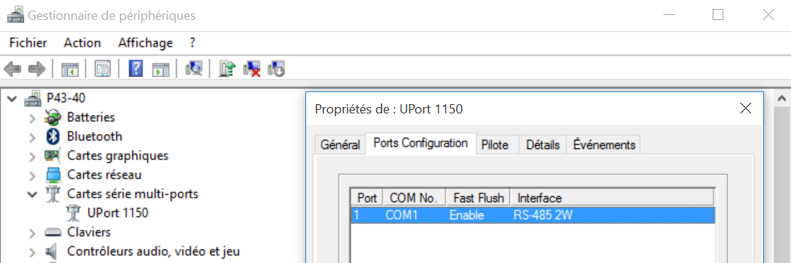
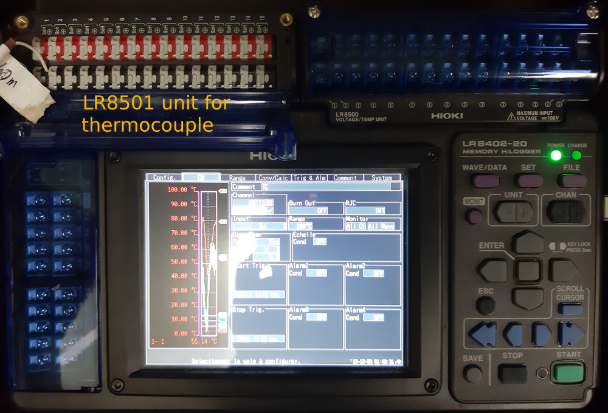
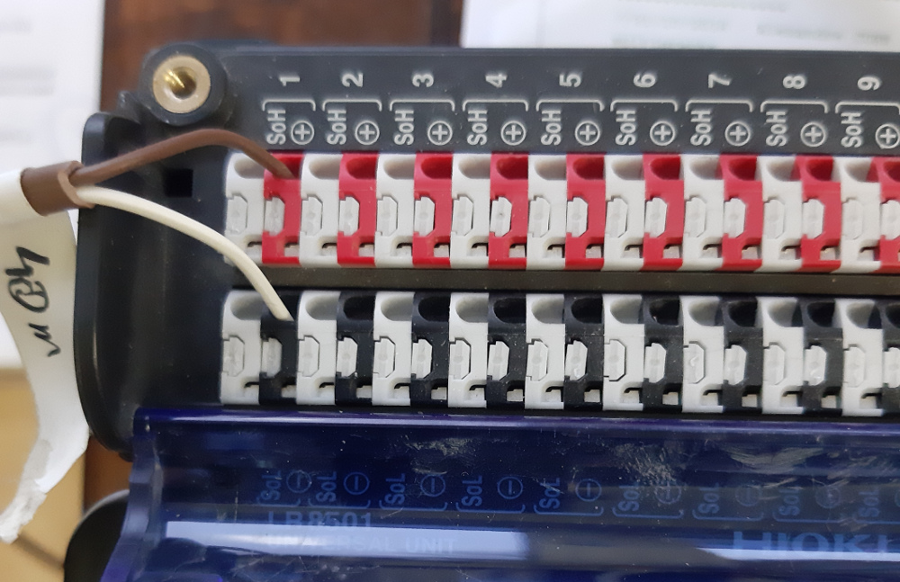

## Using PT 100 to measure fluid temperatures in a heating network

A convenient solution is to use a modbus module, such as Promux [pm6rtd](https://www.proconel.com/product/pm6rtd-6-rtd-input-module/)

[modbus error codes](http://www.simplymodbus.ca/exceptions.htm)

We will use a USB to serial adapter : the moxa uport 1150 - [download MOXA uport drivers](https://www.moxa.com/en/products/industrial-edge-connectivity/usb-to-serial-converters-usb-hubs/secure-routers/uport-1000-series#resources)

#### Check the Moxa configuration

On a window desktop, go to the device manager and fit the Moxa so it works in RS485(2W)

Here the Moxa appears on COM1




## Using thermocouple (Seebeck effect)

Type T

Composition : copper / Constantan (copper + nickel)

From −185 °C to 300 °C ;

accuracy  +/-0,1 °C from −200 °C to 200 °C.

CEI 584-3  
> - brown rubber sheath
> - brown = +
> - white = -

Using the HIOKI 8402-20 datalogger with a universal analog input unit LR8501

[Hioki 8402 product page](https://www.hioki.com/en/products/detail/?product_key=5613)





Configure the HIOKI 8204 for DHCP and connect it to the smartflex via an ethernet cable

Define a static DHCP lease for the HIOKI, using its MAC address :


use the specific Hioki socket interfacer for emonhub :

```
[[HiokiTCP]]  
    Type = EmonHiokiTcpInterfacer
    [[[init_settings]]]
	    IP = 192.168.2.3   # ip address of client to retrieve data from
	    port = 8802          # Portclient listens on
    [[[runtimesettings]]]
           pubchannels = ToEmonCMS,
           nodeId = 1
           # interrogation interval in seconds 
           interval = 10
```

node configuration

```
[[1]]
    nodename = Hioki8402
    [[[rx]]]
       names = TC1,TC2,TC3
       channels = 1,1,1
       voice = 1,2,3
```

There is no datacode to fix : the HIOKI is streaming ASCII and the decoding is integrated to the interfacer
