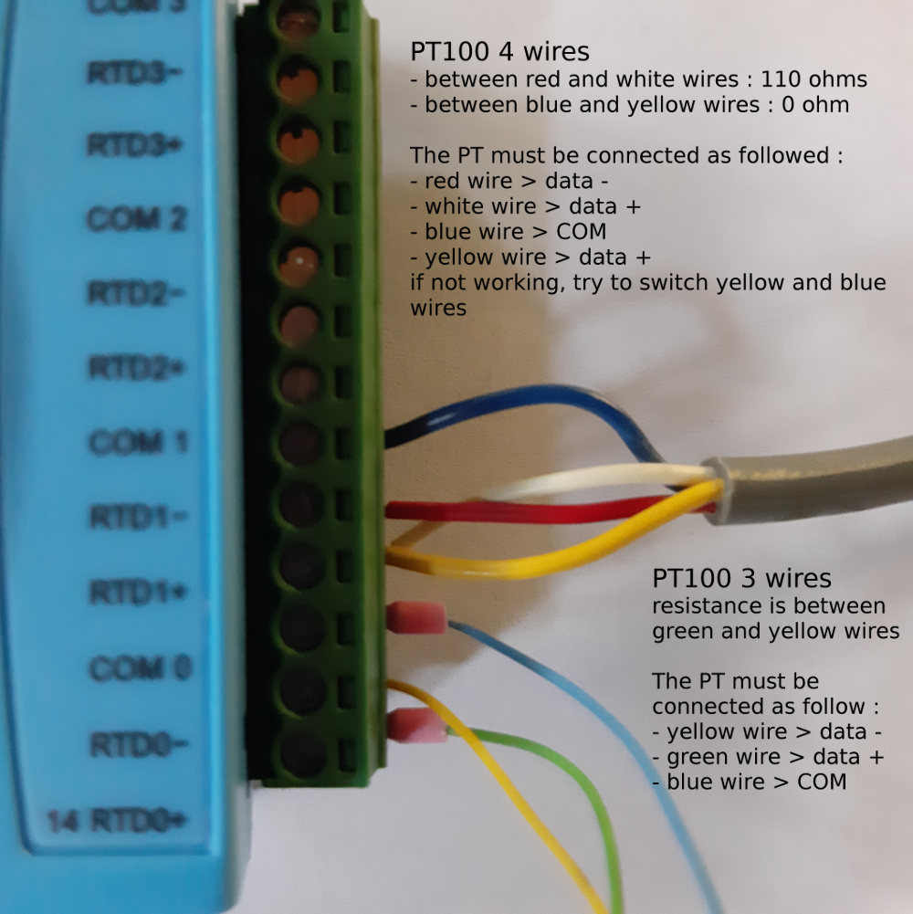
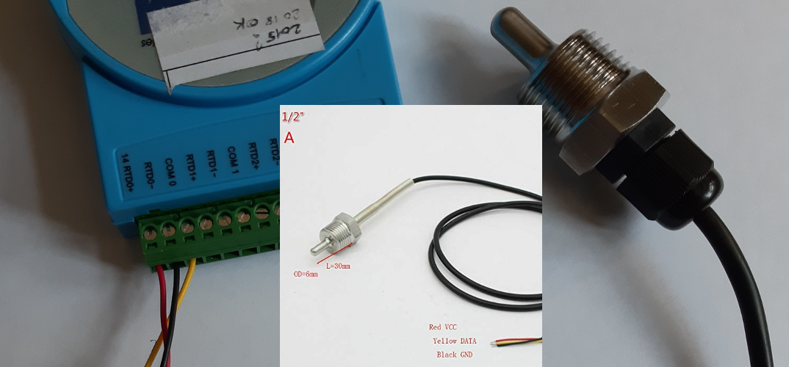
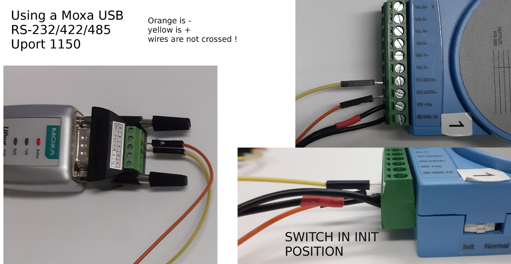
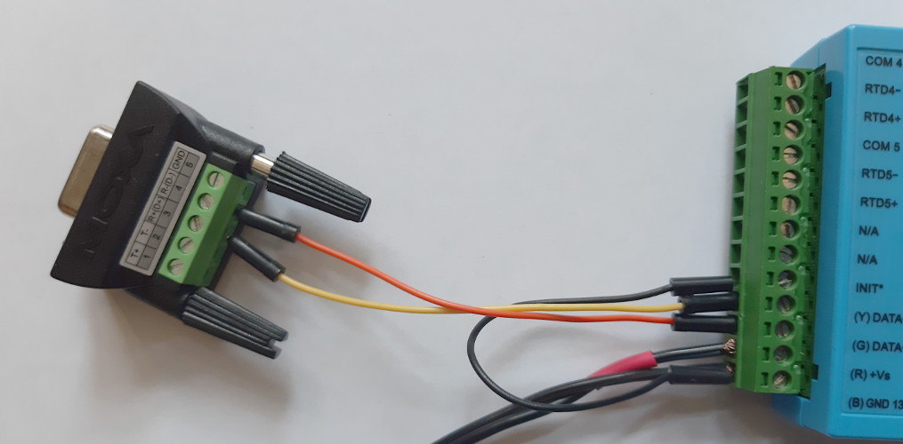

# connect PT100 to ADAM4015

Using an ohmmeter, find the wires between which a resistance is present

many PT100 follow a specific color code and you dont need an ohmmeter : 
- red = VCC > RTD+
- black = GND > RTD-
- yelow = DATA > COM

# Configure ADAM4015 for operation on a RS485 network

For ADAM configuration, Advantech provides the [ADAM utility](https://support.advantech.com/support/DownloadSRDetail_New.aspx?SR_ID=1-9HOC2&Doc_Source=Download)

## Init mode

Booting the ADAM4015 in Init mode can be done by using the specific switch on recent models or by connecting the init terminal to the
GND terminal

connect all the wires on the green terminal block, plug the block in the module, with the switch in INIT mode and power on with a 12v AC-DC alimentation !

Init mode on an older model, without switch

