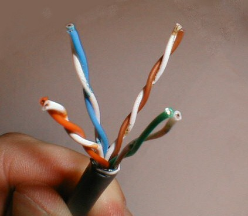

## the DS18B20 sensor
The [DS18B20P](DS18B20-PAR.pdf) is a parametric version of the classic [DS18B20](DS18B20.pdf) temperature sensor from maxim integrated. Only 2 pins are to be connected : data and ground. The sensor is powered through the data pin.

you can buy some single wire sensors through the [Farnell reseller](https://fr.farnell.com/maxim-integrated-products/ds18b20-par/capteur-temperature-nv-alarm-3to92/dp/2519162)

## the Emonpi RJ45 connector
The emonPI embed an RJ45 port for connecting single-wire temperature sensors. 
The DS18B20P has to be connected through pins 4 and 5. If using a classic DS18B20, also plan to use pin 2 for 5V power.

## soldering the DS18B20
You can use a T568B RJ45 cable to make the connection

<ul id="profileTabs" class="nav nav-tabs">
    <li class="active"><a href="#a1" data-toggle="tab">step 1</a></li>
    <li><a href="#a2" data-toggle="tab">step 2</a></li>
    <li><a href="#a3" data-toggle="tab">step 3</a></li>
    <li><a href="#a4" data-toggle="tab">step 4</a></li>
    <li><a href="#a5" data-toggle="tab">step 5</a></li>
</ul>

Cut the RJ45 cable, identify its 4 pairs.
 
<b>From left to right : orange, green and brown and blue.</b>
 The DS18B20 will have to be connected to the wires of the blue pair.
 

Strip the wires of the blue pair with a wire stripper (you can find some <a class="card-link" href="https://www.fac18.eu/dz-fr/categorie/electricite">FACOM</a>).
 

add some solder on both wires 

Identify the pins of the DS18B20. 
 
Note that the parametric version is always packaged as a <a href="https://en.wikipedia.org/wiki/TO-92">TO-92</a>.
 
To do so, you must distinguish the front panel (on which you can read the brand and type of the sensor).
 

Add some soldering on pins 1 and 2 of the DS19B20.
 

## anatomy of a 568B RJ45 cable

### the 4 pairs of wires of an RJ45 cable

pair|number
--|--
blue/white|1
orange/white|2
green/white|3
brown/white|4

### Link to the pins of the RJ45 connector, for a T568B cable

pin|wire color|pair number
--|--|--
1||2
2||2
3||3
4||1
5||1
6||3
7||4
8||4

for more complete information, check [wikipedia](https://fr.wikipedia.org/wiki/RJ45)
