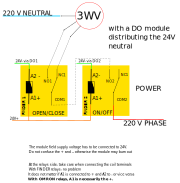
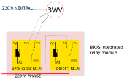

It is quite easy to command a ON/OFF actuator such as a pump with a relay but the case of 3-way valves is a little more delicate.

## Modbus

2 use cases are covered in the following schematics :

- via a promux PM4RO external module
- via a digital output external module (promux PM16DO or PM8DIO)

## Using a relay module connected to the GPIO

This is not an industrial solution but if you search for relay + arduino on amazon for example, you can find cheap modules with 8 relays on board.

A small python code will help you to check the connections of the relay module on the GPIO.

- in the `tests` folder of the BIOS2 directory,
- run : `python3 relayzero.py` to switch the first 8 relays ON and OFF

The next step is to connect a 3-way valve as following :

- in the `hardware` folder of the BIOS2 directory,
- run `relay.py` to command the valve using gpiozero or wiringpi library
