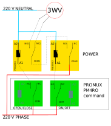

## how to connect a 3-way valve

It is quite easy to command a ON/OFF actuator such as a pump with a relay but the case of 3 way valves is a little more delicate.

2 use cases are covered in the following schematics :

- via a promux PM4RO external module
- via a digital output external module (promux PM16DO or PM8DIO)

## using a relay module connected to the GPIO

