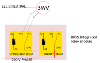
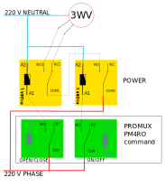
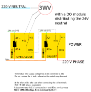

The THEMIS/BIOS softwares can be installed on an [emonpi](https://shop.openenergymonitor.com/emonpi/) or on a specific BIOS hardware. 

On both of these hardwares, the man machine interface is very basic and consists of a 2 lines LCD screen plus a push button.

The man machine service called ihm can be configured so that a long press on the push button can start/stop the actuators connected to the gpio (pinout mode) or to a digital output modbus module connected to BIOS via an RS485 USB dongle (registers mode). 

## installation

As usual, manually start the runner to create a sample conf file : 
```
cd /opt/openenergymonitor/BIOS2/hardware
./ihm.py
```
Then install with the makefile :
```
make install name=ihm
```

To uninstall :

```
make uninstall name=ihm
```

## configuration file

The following configuration has got the classic gpio/pinout parameters and the ability to command two relays via a DO module. Please note the ihm service searches automatically for the first DO module connected on the RTU bus so you do not have to fix any id.

The `nb*` keys permit to define how many actuators are available through the man machine interface. 

In this example, you can command **five** 3-way valves plus **one** pump, all connected to the gpio, and no actuator will be available through the modbus/RS485 protocol. 

```
{
    "nbgpiores": 1,
    "nbgpiov3v": 5,
    "nbmodres": 0,
    "nbmodv3v": 0,
    "pinout": {
        "v3v": [0, 2, 4, 6, 10, 12, 21],
        "res": [23, 24]
    },
    "registers": {
        "v3v": [],
        "res": [0, 1]
    }
}
```
**Legend :**
- res stands for on/off equipment
- v3v stands for 3-way valve
- mod stands for modbus/TS485 protocol
- gpio stands for direct gpio connexion using wiringpi or gpiozero libraries 

## how to connect a 3-way valve

It is quite easy to command a ON/OFF actuator such as a pump with a relay but the case of 3 way valves is a little more delicate.

3 use cases are covered in the following schematics :

- via BIOS gpio integrated relay module
- via a promux PM4RO external module
- via a digital output external module (promux PM16DO or PM8DIO)






