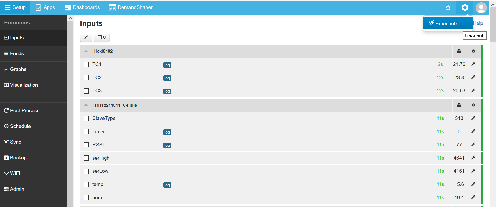
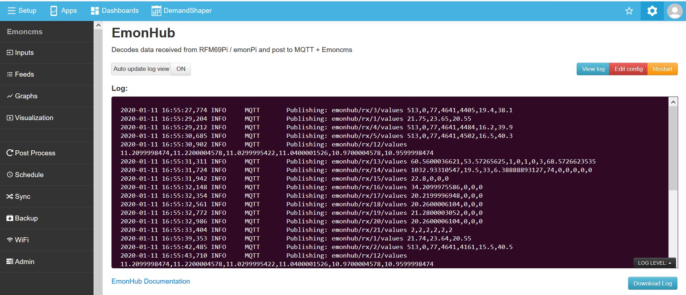

for most operations related to sensor's connectivity, Themis uses emonhub, a python service to handle socket, serial or radio connections

Once logged to Themis, Emonhub user interface can be easily found.



Emonhub's user interface permits :
- to visualize in real time if data processing is correctly performed
- to edit a config file, in order to activate new sensors, never activated before in the hub...



## Emonhub configuration

```
[interfacers]
[[ModbusTCP]]
    Type = EmonModbusTcpInterfacer2
    [[[init_settings]]]
        modbus_IP = 192.168.1.1 # ip address of client to retrieve data from
        modbus_port = 503 # Portclient listens on
        fCode = 3 # optional if using function code 3 (read holding registers) - with fCode = 4, the interfacer will read input registers
    [[[runtimesettings]]]
        nodeIds = 23,24
        pubchannels = ToEmonCMS,
        # time in seconds between checks, This is in addition to emonhub_interfacer.run() sleep time of .01
        interval = 60
```

node configuration

```
[[23]]
    nodename = TRH12220020
    [[[rx]]]
       names = SlaveType,Timer,RSSI,serHigh,serLow,temp,hum
       registers = 31048,31049,31050,31051,31052,31053,31054
       datacode = H
       scales = 1,1,0.5,1,1,0.1,0.1

[[24]]
    nodename = CO218251004
    [[[rx]]]
        names = SlaveType,Timer,RSSI,serHigh,serLow,co2,temp,hum
        registers = 31092,31093,31094,31095,31096,31097,31098,31099
        datacode = H
        scales = 1,1,0.5,1,1,1,0.1,0.1
```
