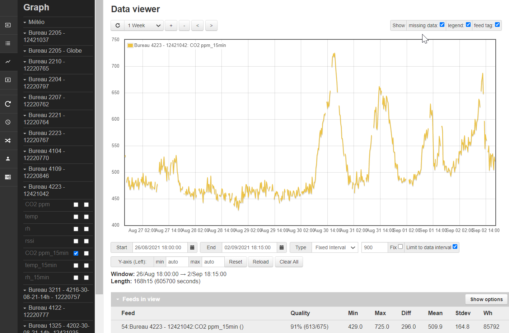

Datas from the sensors are displayed in real time in the inputs tab and can be easily historized into feeds.

To achieve this, you simply assign to the input a process named `log to feed`, choosing a PHPFINA engine, which is our favorite binary timeserie, simple but fast, efficient and robust

The recording step should be an integer multiple of the interval at which the sensor transmits its data: if the sensor is configured to transmit a measurement each 5 minutes, the step should be set to 5 or 10 minutes, but in no case to 60 seconds.  

Data logged to feed is often a raw material, but please note that Emoncms offers a diversity of realtime processing which can be very practical, such as calibration, accumulation (usefull for energy feeds) or daily min and max values.

## Quality management

In radio technology, reception is considered good when more than 80% of the expected data is received. The following illustration shows a reception quality of 90%. The field `show missing data` is checked and the graph shows clearly the data gaps

