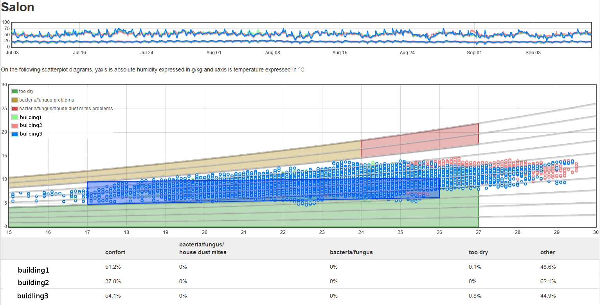
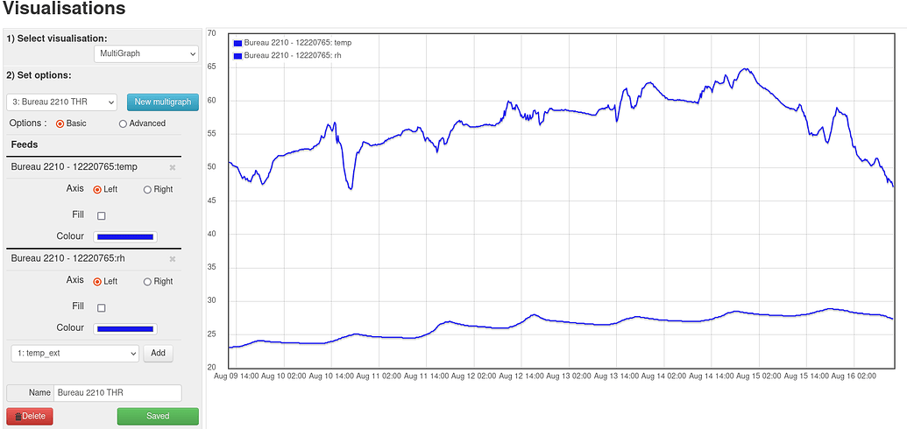
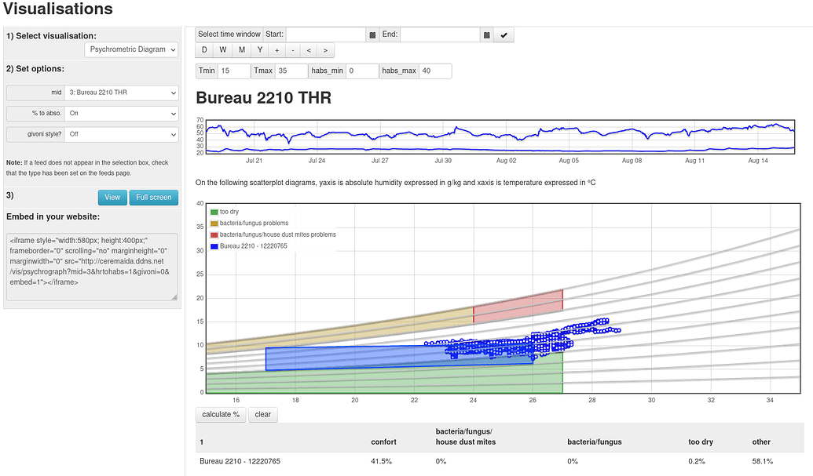

Psychrographic diagrams are a way to appreciate the thermal comfort of a house. All you need is a simple sensor of temperature and relative humidity. The principle is to represent the absolute humidity as a function of temperature.

The graph is initially populated by 10 curves of iso relative humidity, represented in light gray. The lower curve corresponds to a relative humidity of 10%, the upper one to a relative humidity of 100%.

We then materialize the zones where it’s not good to be:

- the too dry part (green) is the one below the curve of 40% iso humidity curve.
- the parts that are too humid (red/orange) are between the saturation curve (100%) and the 80% iso humidity curve, in which the risks of development of moisture and fungi are high. The graph is ready to receive the measured values. The calculation of absolute humidity for a pressure of 101325 pa (the atmospheric pressure at sea level) is relatively [simple](https://github.com/emoncms/emoncms/blob/master/Modules/vis/visualisations/psychrograph.php#L146).

From a practical point of view, you just have to build multigraphs in emoncms and use them in the pshychrographic visualization to appreciate the comfort level of your home.

More details on [1](https://sustainabilityworkshop.venturewell.org/node/1195.html) and [2](https://sustainabilityworkshop.venturewell.org/node/1195.html)

