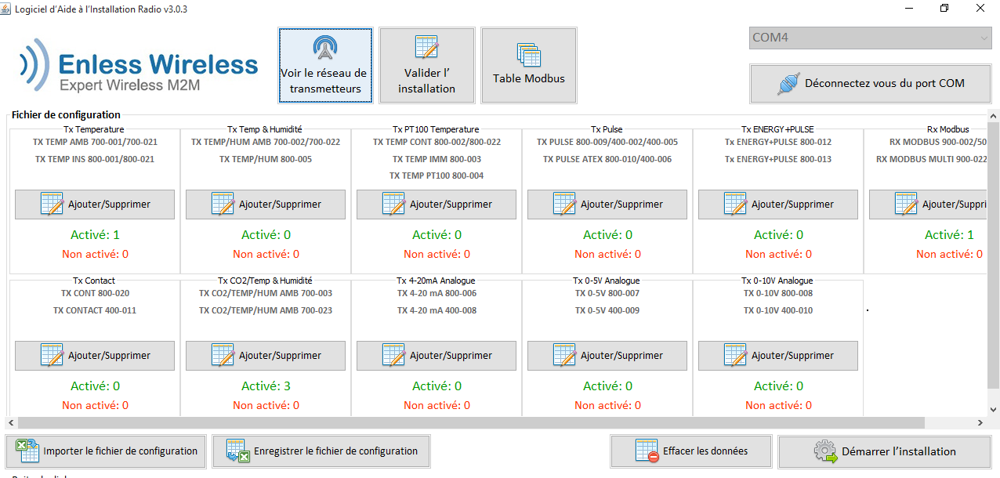

installation des transmetteurs

```
[07-oct.-2020 11:27:36] Log in utilisateur: User
[07-oct.-2020 17:40:38] Port série connecté COM4@19200
[07-oct.-2020 17:41:42] Port série connecté COM4@19200
[07-oct.-2020 17:42:02] Démarrage de l’installation
[07-oct.-2020 17:42:48] Demande d'installation pour TX CO2 12421037 RSSI:-44,0dBm
[07-oct.-2020 17:42:50] Acquittement en phase d'installation 12421037 RSSI:-59,0dBm
[07-oct.-2020 17:42:52] Niveau RSSI en phase d'installation 12421037 RSSI:-29,0dBm
[07-oct.-2020 17:42:53] Niveau RSSI en phase d'installation 12421037 RSSI:-18,0dBm
[07-oct.-2020 17:42:55] Niveau RSSI en phase d'installation 12421037 RSSI:-18,0dBm
[07-oct.-2020 17:42:57] Niveau RSSI en phase d'installation 12421037 RSSI:-18,0dBm
[07-oct.-2020 17:42:59] Niveau RSSI en phase d'installation 12421037 RSSI:-18,0dBm
[07-oct.-2020 17:43:01] Succès de l'installation TX CO2 12421037 RSSI:-23,0dBm
[07-oct.-2020 17:43:38] Demande d'installation pour TX CO2 12421042 RSSI:-31,0dBm
[07-oct.-2020 17:43:40] Acquittement en phase d'installation 12421042 RSSI:-30,0dBm
[07-oct.-2020 17:43:42] Niveau RSSI en phase d'installation 12421042 RSSI:-27,0dBm
[07-oct.-2020 17:43:44] Niveau RSSI en phase d'installation 12421042 RSSI:-30,0dBm
[07-oct.-2020 17:43:46] Niveau RSSI en phase d'installation 12421042 RSSI:-31,0dBm
[07-oct.-2020 17:43:48] Niveau RSSI en phase d'installation 12421042 RSSI:-26,0dBm
[07-oct.-2020 17:43:49] Niveau RSSI en phase d'installation 12421042 RSSI:-26,0dBm
[07-oct.-2020 17:43:51] Succès de l'installation TX CO2 12421042 RSSI:-26,0dBm
[07-oct.-2020 17:44:19] Demande d'installation pour TX CO2 12421035 RSSI:-27,0dBm
[07-oct.-2020 17:44:25] L'installation a échoué !! Message Timeout
[07-oct.-2020 17:44:52] Demande d'installation pour TX TEMP 12310268 RSSI:-30,0dBm
[07-oct.-2020 17:44:58] L'installation a échoué !! Message Timeout
[07-oct.-2020 17:45:21] Demande d'installation pour TX TEMP 12310268 RSSI:-18,0dBm
[07-oct.-2020 17:45:23] Acquittement en phase d'installation 12310268 RSSI:-18,0dBm
[07-oct.-2020 17:45:25] Niveau RSSI en phase d'installation 12310268 RSSI:-18,0dBm
[07-oct.-2020 17:45:27] Niveau RSSI en phase d'installation 12310268 RSSI:-18,0dBm
[07-oct.-2020 17:45:29] Niveau RSSI en phase d'installation 12310268 RSSI:-18,0dBm
[07-oct.-2020 17:45:31] Niveau RSSI en phase d'installation 12310268 RSSI:-18,0dBm
[07-oct.-2020 17:45:33] Niveau RSSI en phase d'installation 12310268 RSSI:-18,0dBm
[07-oct.-2020 17:45:35] Succès de l'installation TX TEMP 12310268 RSSI:-18,0dBm
[07-oct.-2020 17:45:48] Demande d'installation pour TX CO2 12421035 RSSI:-30,0dBm
[07-oct.-2020 17:45:50] Acquittement en phase d'installation 12421035 RSSI:-42,0dBm
[07-oct.-2020 17:45:52] Niveau RSSI en phase d'installation 12421035 RSSI:-41,0dBm
[07-oct.-2020 17:45:54] Niveau RSSI en phase d'installation 12421035 RSSI:-41,0dBm
[07-oct.-2020 17:45:56] Niveau RSSI en phase d'installation 12421035 RSSI:-30,0dBm
[07-oct.-2020 17:45:58] Niveau RSSI en phase d'installation 12421035 RSSI:-26,0dBm
[07-oct.-2020 17:45:59] Niveau RSSI en phase d'installation 12421035 RSSI:-26,0dBm
[07-oct.-2020 17:46:01] Succès de l'installation TX CO2 12421035 RSSI:-32,0dBm
```
installation du receveur
```
[07-oct.-2020 17:51:51] Port série connecté COM4@19200
[07-oct.-2020 17:51:52] Demande d'installation pour Receiver 21521732
[07-oct.-2020 17:51:58] Acquittement en phase d'installation Receiver 21521732
[07-oct.-2020 17:52:04] Succès de l'installation Receiver 21521732
[07-oct.-2020 17:52:18] Arrêter l’installation
```

