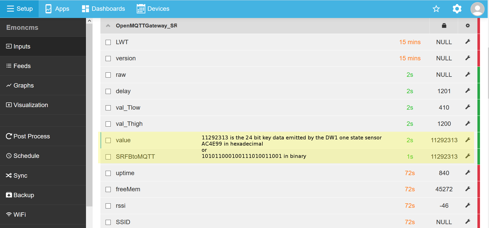

As I was developping Themis further on, Cerema teams requested the integration of window opening/closing sensors into the system, 
in connection with their work on indoor air quality.
Measuring indoor air quality without knowing whether windows are open or closed makes little sense.

A first test was done with the Sonoff DW1, a door intrusion sensor that can detect the opening status.
The DW1 sensor is designed to send its radio payloads to a [Sonoff RF Bridge 433](https://www.itead.cc/wiki/Sonoff_RF_Bridge_433), which works as a Wifi/radio hub, embedding a lowcost ESP8285 microchip that can be easily reprogrammed. The 433 Mhz radio communication is managed by an 8 bit microcontroller EFM8BB10F8G from siliconlabs (associated to a SYN470R [superheterodyne receiver](https://en.wikipedia.org/wiki/Superheterodyne_receiver) from Synoxo). The interesting part is that the ESP8285 can communicate with the EFM8BB10 with a protocol described by Itead and called [RF universal transceiver module serial protocol](https://www.itead.cc/wiki/images/5/5e/RF_Universal_Transeceive_Module_Serial_Protocol_v1.0.pdf)


Some github projects focused on developping opensource firmwares for the Sonoff RF Bridge 533, such as [openMQTTgateway](https://github.com/1technophile/OpenMQTTGateway) and [espurna](https://github.com/xoseperez/espurna)

These developments are based on the [rc-switch library](https://github.com/sui77/rc-switch) for radio functionalities and on the [pubsubclient Arduino Client](https://github.com/knolleary/pubsubclient) for the MQTT part

With minimal effort, it is possible to use the sonoff DW1 in Themis or Emoncms

## soldering pin header to connect a UART2USB programming cable
before soldering<br> 

<br>after soldering<br>

<br>bottom view after soldering<br>


## backup the stock/factory firmware on the Sonoff RF bridge
This part will use the esptool which you can install easily
```
pip install esptool
```
you can find a [full article](https://github.com/xoseperez/espurna/wiki) on this thema

Before using esptool in cli you will need to connect the bridge to your computer in flashmode :

1) Connect the ESP8286 header to your USB2UART programmer (RX to TX, TX to RX and GND to GND)

2) Place the switch in the OFF position

3) Press and hold the reset button

4) And power the device either via the microUSB port or via the 3V3 pin on the same programming header


<br>wire color codes are red : 3V, black : ground, yellow : RX, orange : TX from the bridge

You can get the firmware size with the command `esptool flash_id`  
```
esptool.py v2.8
Found 1 serial ports
Serial port COM4
Connecting....
Detecting chip type... ESP8266
Chip is ESP8285
Features: WiFi, Embedded Flash
Crystal is 26MHz
MAC: 84:0d:8e:66:92:4c
Uploading stub...
Running stub...
Stub running...
Manufacturer: 51
Device: 4014
Detected flash size: 1MB
Hard resetting via RTS pin...
```

The size being known, you can now backup the 1Mo firmware `esptool --port COM4 read_flash 0x00000 0x100000 esp-1MB-backup.bin`
```
esptool.py v2.8
Serial port COM4
Connecting....
Detecting chip type... ESP8266
Chip is ESP8285
Features: WiFi, Embedded Flash
Crystal is 26MHz
MAC: 84:0d:8e:66:92:4c
Uploading stub...
Running stub...
Stub running...
1048576 (100 %)
1048576 (100 %)
Read 1048576 bytes at 0x0 in 98.7 seconds (85.0 kbit/s)...
Hard resetting via RTS pin...
```

Image restoration can be achieved specifying the starting address:
```
esptool --port COM4 write_flash 0x00000 esp-1MB-backup.bin
```

## burn the OpenMQTTGateway firmware into the bridge
The best choice to compile and burn the firmware is to use [Atom](https://atom.io/) and its integrated terminal platformio-ide-terminal. Indeed, platformIO takes care of all dependencies for you...

In atom, open the folder named "OpenMQTTGateway", open the platformio.ini file and uncomment the rfbridge line
```
default_envs = rfbridge
```
all others modifications have to be done within the main/User_config.h

the easiest solution is to use a wifi in manual mode. To achieve that, just uncomment the `#define ESPWifiManualSetup true` line :
```
/*-------------DEFINE YOUR  NETWORK PARAMETERS BELOW----------------*/
#if defined(ESP8266)||defined(ESP32)  // for nodemcu, weemos and esp8266
  #define ESPWifiManualSetup true //uncomment you don't want to use wifimanager for your credential settings on ESP
#endif
```

Just below, fill in the credentials so that they fit to the local wifi network where the mqtt server is located 
```
#if defined(ESPWifiManualSetup) // for nodemcu, weemos and esp8266
  #define wifi_ssid "your_ssid"
  #define wifi_password "your_password"
#else // for arduino + W5100
  const byte mac[] = {  0xDE, 0xED, 0xBA, 0xFE, 0x54, 0x95 }; //W5100 ethernet shield mac adress
#endif
```

Still in main/User_config.h, define the mqqt parameters of the receiving server and give give the value `emon` to the database topic used by openMQTTgateway for data publication. If you are using a standard emoncms configuration : 
```
/*-------------DEFINE YOUR MQTT PARAMETERS BELOW----------------*/
char mqtt_user[20] = "emonpi"; // not compulsory only if your broker needs authentication
char mqtt_pass[30] = "emonpimqtt2016"; // not compulsory only if your broker needs authentication
char mqtt_server[40] = "192.168.1.27";
char mqtt_port[6] = "1883";

/*-------------DEFINE YOUR MQTT ADVANCED PARAMETERS BELOW----------------*/
#define Base_Topic "emon/"
```

On the raspberry running themis/emoncms, just check if your broker is receiving some datas :
```
mosquitto_sub -h localhost -t "#" -v -u emonpi -P emonpimqtt2016
```
try to simulate an intrusion with the DW1 sensor, the mosquitto_sub command should display the following datas
```
emon/OpenMQTTGateway_SRFB/SRFBtoMQTT {"raw":"2ED6019A04B0AC4E99","delay":1199,"val_Tlow":410,"val_Thigh":1200,"value":11292313}
emon/OpenMQTTGateway_SRFB/SRFBtoMQTT/raw 2ED6019A04B0AC4E99
emon/OpenMQTTGateway_SRFB/SRFBtoMQTT/delay 1199
emon/OpenMQTTGateway_SRFB/SRFBtoMQTT/val_Tlow 410
home/OpenMQTTGateway_SRFB/SRFBtoMQTT/val_Thigh 1200
home/OpenMQTTGateway_SRFB/SRFBtoMQTT 11292313
```
if you do not have the mosquitto_sub command installed on your raspberry :
```
sudo apt-get install mosquitto-clients
```
## Monitor in Themis/EmonCMS

You should now see the sensor in emoncms :



And be able to start a log to feed process in a variable interval timeseries (PHPimeSeries) :


Window openings appear in green, interior temperature measurements in red/orange and exterior temperature in blue

The orange curve corresponds to a position of the sensor close to the ground, the red curves to high positions
