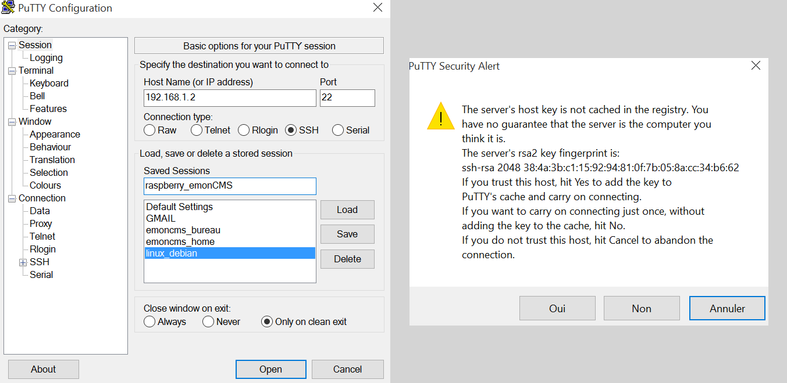

## Themis without any SIM

It is possible to use Themis without SIM, but you may have difficulties related to time and date.

Indeed, for time management, linux systems typically synchronise with NTP (Network Time Protocol) servers.

Anyway, when booting a Themis machine without connecting it to a network linked to a NTP server, it is possible to manually set time on Themis

Once logged with a desktop machine to the Themis network (using wifi or wired connection through an RJ45 cable), the Themis server can be usually reached on 192.168.1.2. 

You will need to establish a SSH connection using the Putty software (which is a simple exe file in a windows 10 environment). 

Just download the [zip](putty.zip), unzip, drop the exe file on the desktop for example and launch it.



### fix geographic area and time zone

Choose Europe for Geographic area and Paris for Time zone

```language
sudo raspi-config
```

<span class="label label-danger">Localisation Options</span> >> <span class="label label-danger">Change Timezone</span> >> <span class="label label-danger">Europe</span> >> <span class="label label-danger">Paris</span>

```conf
Current default time zone: 'Europe/Paris'
Local time is now:      Sat Dec 16 19:57:26 CET 2017.
Universal Time is now:  Sat Dec 16 18:57:26 UTC 2017.
````

Check current time

```language
date
````

```conf
Sat 16 Dec 19:57:36 CET 2017
````

### fix date

#### manual fix


```language
sudo date MMDDhhmmYY.ss
````

#### using a local NTP server

We assume you know the address of a NTP server that can be reached by Themis, eg ntp.as.i2

```language
sudo nano /etc/systemd/timesyncd.conf
````

```conf
#  This file is part of systemd.
#
#  systemd is free software; you can redistribute it and/or modify it
#  under the terms of the GNU Lesser General Public License as published by
#  the Free Software Foundation; either version 2.1 of the License, or
#  (at your option) any later version.
#
# Entries in this file show the compile time defaults.
# You can change settings by editing this file.
# Defaults can be restored by simply deleting this file.
#
# See timesyncd.conf(5) for details.

[Time]
NTP=ntp.as.i2
````

restart the service and check its status

```language
sudo systemctl restart systemd-timesyncd.service
systemctl status systemd-timesyncd.service
````

```conf
● systemd-timesyncd.service - Network Time Synchronization
   Loaded: loaded (/lib/systemd/system/systemd-timesyncd.service; enabled; vendor preset: enabled)
  Drop-In: /lib/systemd/system/systemd-timesyncd.service.d
           └─disable-with-time-daemon.conf
   Active: active (running) since Thu 2019-06-20 10:20:14 CEST; 5min ago
     Docs: man:systemd-timesyncd.service(8)
 Main PID: 1512 (systemd-timesyn)
   Status: "Synchronized to time server xx.xxx.xxx.x:123 (ntp.as.i2)."
   CGroup: /system.slice/systemd-timesyncd.service
           └─1512 /lib/systemd/systemd-timesyncd

juin 20 10:20:14 emonpi systemd[1]: Starting Network Time Synchronization...
juin 20 10:20:14 emonpi systemd[1]: Started Network Time Synchronization.
juin 20 10:20:38 emonpi systemd-timesyncd[1512]: Synchronized to time server xx.xxx.xxx.x:123 (ntp.as.i2).
````

