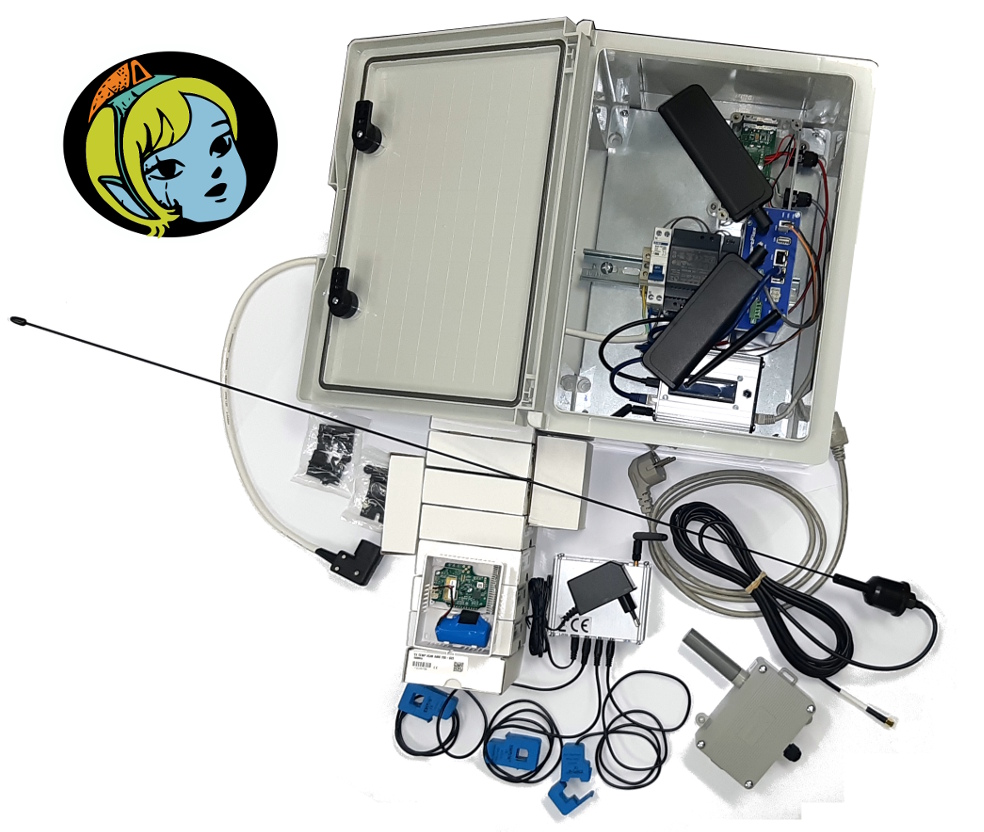
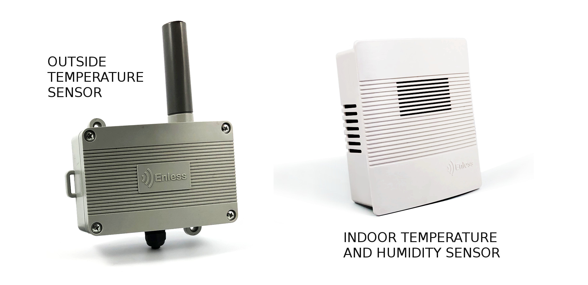
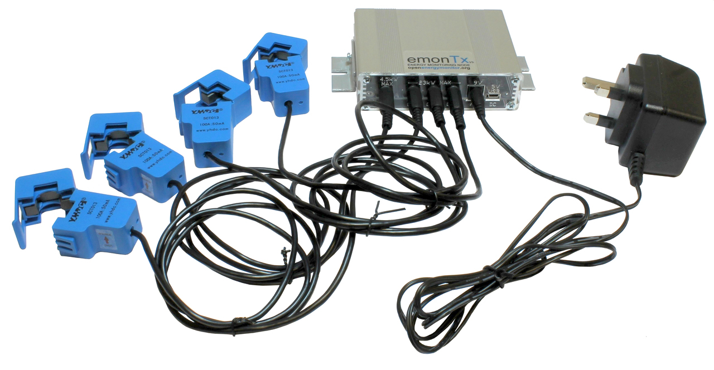
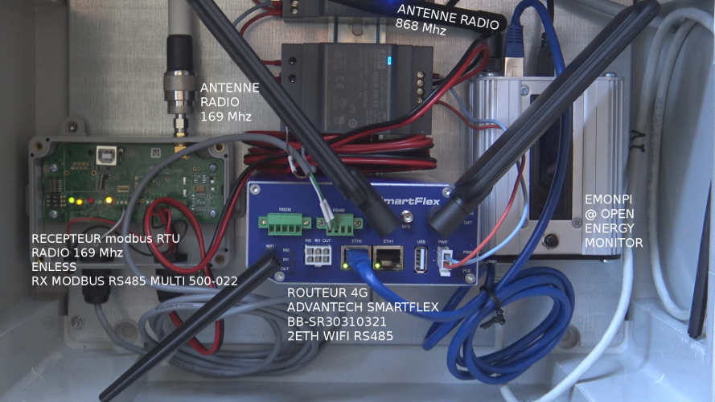

## the Themis basic monitoring kit
### indoor temperature and humidity sensors (x10) plus outside temperature sensor (x1)

### radio energy sensing node, to monitor electric current (x3) and voltage (x1)



M2M : {{site.data.glossary.M2M}}

### the Themis box , ie the "heart" of the system containing all devices necessary for datas aggregation and online availability in real time

In the basic edition, the Themis box includes :

- a radio receiver 169 Mhz for the link with the temperature sensors
- a 4G router
- an emonPI, dedicated to data recording and featuring a 868 Mhz radio receiver to catch data from power consumption sensors (electrical)



