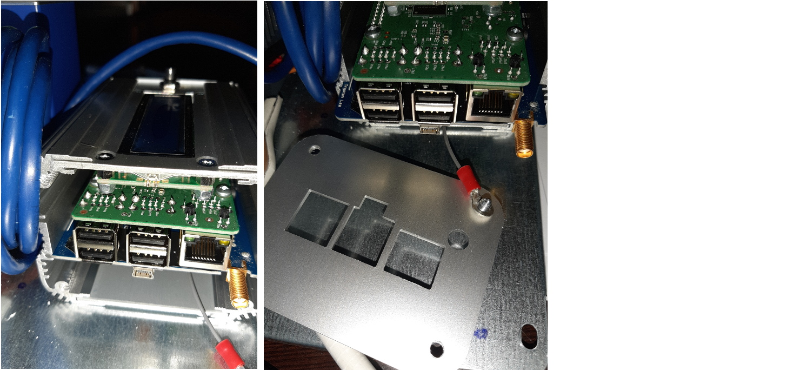

The basic Themis kit contains :
- indoor temperature and humidity sensors (x10)
- outside temperature sensor (x1)
- a radio energy sensing node, to monitor electric current (x3) and voltage (x1)
- the "heart" of the system, i.e. the Themis box containing all devices necessary for datas aggregation and online availability in real time



M2M : {{site.data.glossary.M2M}}

In the basic edition, the Themis box includes :

- a radio receiver 169 Mhz for the link with the temperature sensors
- a 4G router
- an emonPI, dedicated to data recording and featuring a 868 Mhz radio receiver to catch data from power consumption sensors (electrical)

All Themis software is embedded on a SD card.

## inserting the SD card into the emonPI

