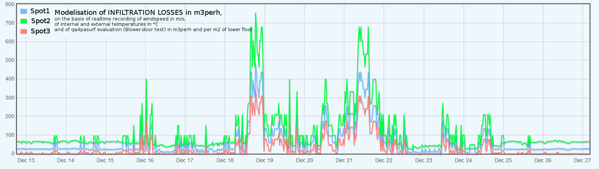

The Themis tools are developped on the basis of the [emoncms](http://github.com/emoncms) ecosystem

They consist of :
- a over the air service for **long range 169Mhz sensors**, with on the fly autodectection
- a modbusTCP service to interact with modbus devices (eg promux) in order to easily operate thermocouple sensors and PT100

- a vizualisation tool for creating **psychrometric** diagrams, to appreciate the thermal comfort of a room
- an algorithm dedicated to the calculation of **infiltration losses** on a building

- a specific interfacer for emonhub managing an ethernet socket on a **HIOKI 8204-20** datalogger
