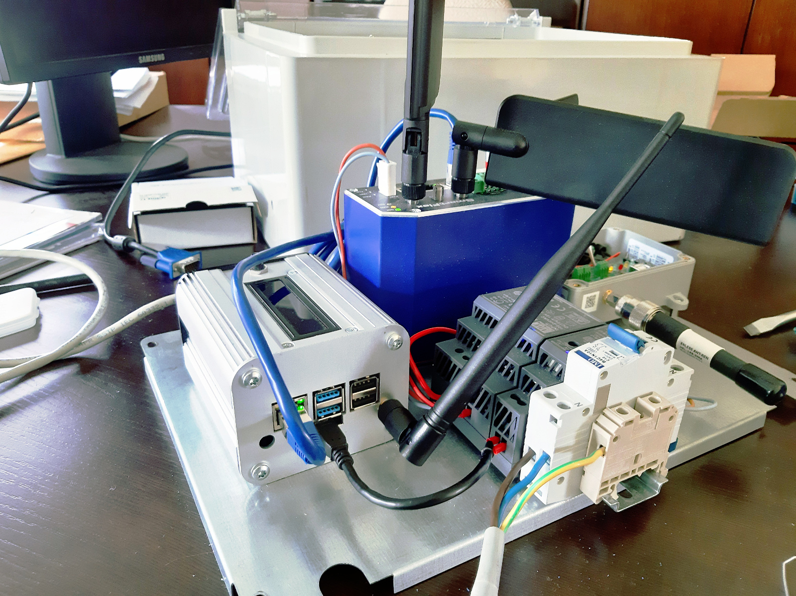
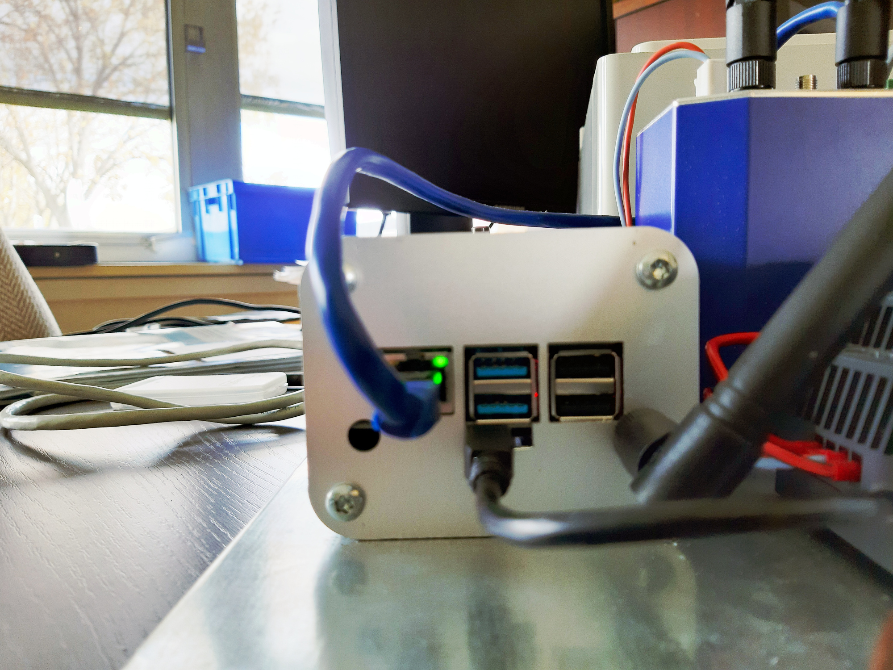
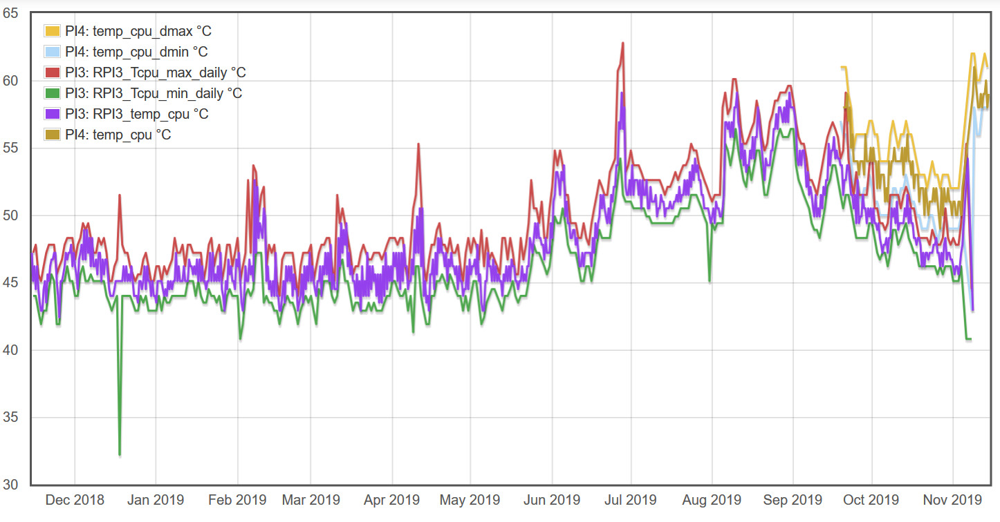
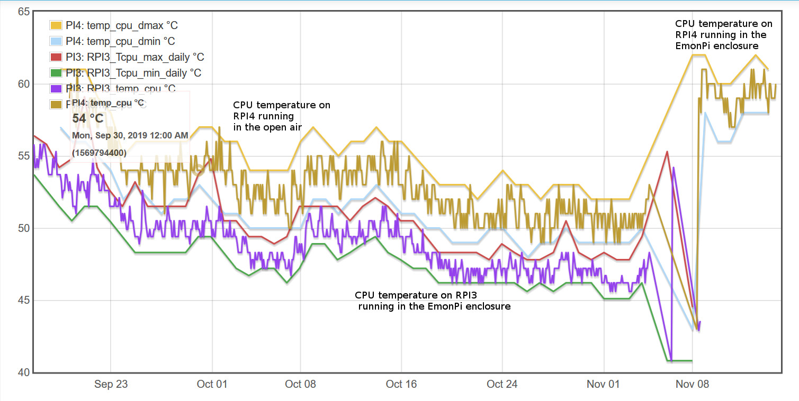

RPI4 is now out and I've modified the EmonPi of one of my themis machine with a brand new RPI4

As the Ethernet port has swapped from right to left, the inside of the faceplate was used on the outside, and an additional hole was made for the 433Mhz antenna





## CPU temperature

much higher on the RPI4 !





## what is inside ?

### cpuinfo

1.5 GHz quad-core Arm® Cortex®-A72 CPU

Just at the end, you can get the serial number of your PI, here `6f1bd081`
```
cat /proc/cpuinfo
processor       : 0
model name      : ARMv7 Processor rev 3 (v7l)
BogoMIPS        : 108.00
Features        : half thumb fastmult vfp edsp neon vfpv3 tls vfpv4 idiva idivt vfpd32 lpae evtstrm crc32
CPU implementer : 0x41
CPU architecture: 7
CPU variant     : 0x0
CPU part        : 0xd08
CPU revision    : 3

processor       : 1
model name      : ARMv7 Processor rev 3 (v7l)
BogoMIPS        : 108.00
Features        : half thumb fastmult vfp edsp neon vfpv3 tls vfpv4 idiva idivt vfpd32 lpae evtstrm crc32
CPU implementer : 0x41
CPU architecture: 7
CPU variant     : 0x0
CPU part        : 0xd08
CPU revision    : 3

processor       : 2
model name      : ARMv7 Processor rev 3 (v7l)
BogoMIPS        : 108.00
Features        : half thumb fastmult vfp edsp neon vfpv3 tls vfpv4 idiva idivt vfpd32 lpae evtstrm crc32
CPU implementer : 0x41
CPU architecture: 7
CPU variant     : 0x0
CPU part        : 0xd08
CPU revision    : 3

processor       : 3
model name      : ARMv7 Processor rev 3 (v7l)
BogoMIPS        : 108.00
Features        : half thumb fastmult vfp edsp neon vfpv3 tls vfpv4 idiva idivt vfpd32 lpae evtstrm crc32
CPU implementer : 0x41
CPU architecture: 7
CPU variant     : 0x0
CPU part        : 0xd08
CPU revision    : 3

Hardware        : BCM2835
Revision        : b03111
Serial          : 100000006f1bd081
```
### memory

2 Gb RAM

```
cat /proc/meminfo
MemTotal:        2036756 kB
MemFree:         1418668 kB
MemAvailable:    1651236 kB
Buffers:           66256 kB
Cached:           275128 kB
SwapCached:            0 kB
Active:           368740 kB
Inactive:         145960 kB
Active(anon):     190908 kB
Inactive(anon):    36748 kB
Active(file):     177832 kB
Inactive(file):   109212 kB
Unevictable:          16 kB
Mlocked:              16 kB
HighTotal:       1284096 kB
HighFree:         828716 kB
LowTotal:         752660 kB
LowFree:          589952 kB
SwapTotal:        102396 kB
SwapFree:         102396 kB
Dirty:                 8 kB
Writeback:             0 kB
AnonPages:        173332 kB
Mapped:            95780 kB
Shmem:             54344 kB
Slab:              75940 kB
SReclaimable:      35268 kB
SUnreclaim:        40672 kB
KernelStack:        1504 kB
PageTables:         4188 kB
NFS_Unstable:          0 kB
Bounce:                0 kB
WritebackTmp:          0 kB
CommitLimit:     1120772 kB
Committed_AS:    1320888 kB
VmallocTotal:     245760 kB
VmallocUsed:           0 kB
VmallocChunk:          0 kB
Percpu:             2144 kB
CmaTotal:         262144 kB
CmaFree:          255744 kB
```
