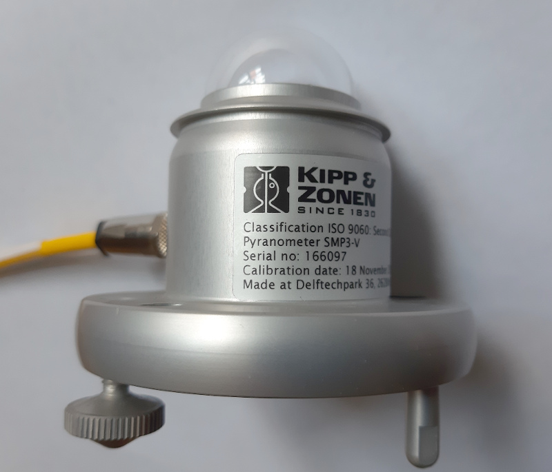
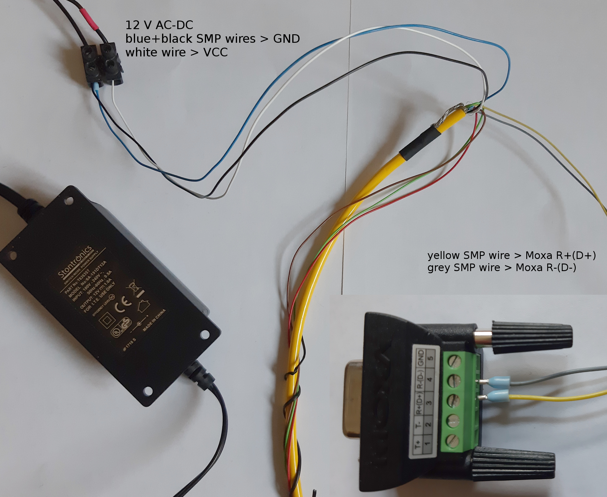
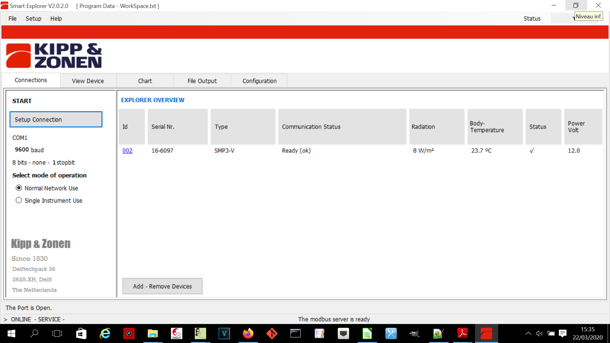
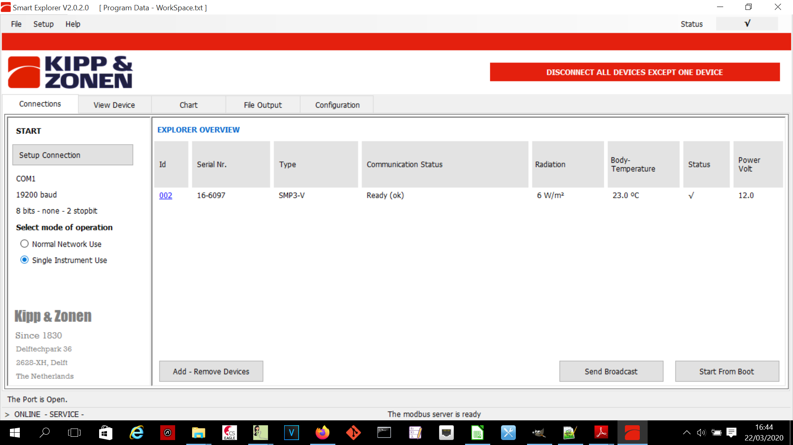
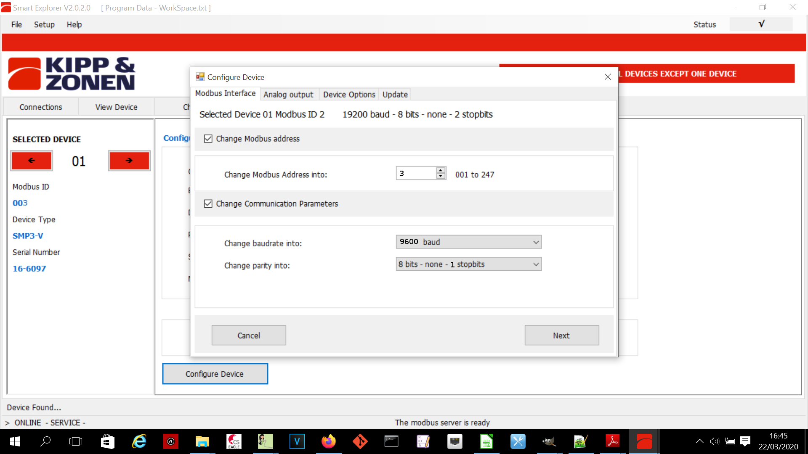
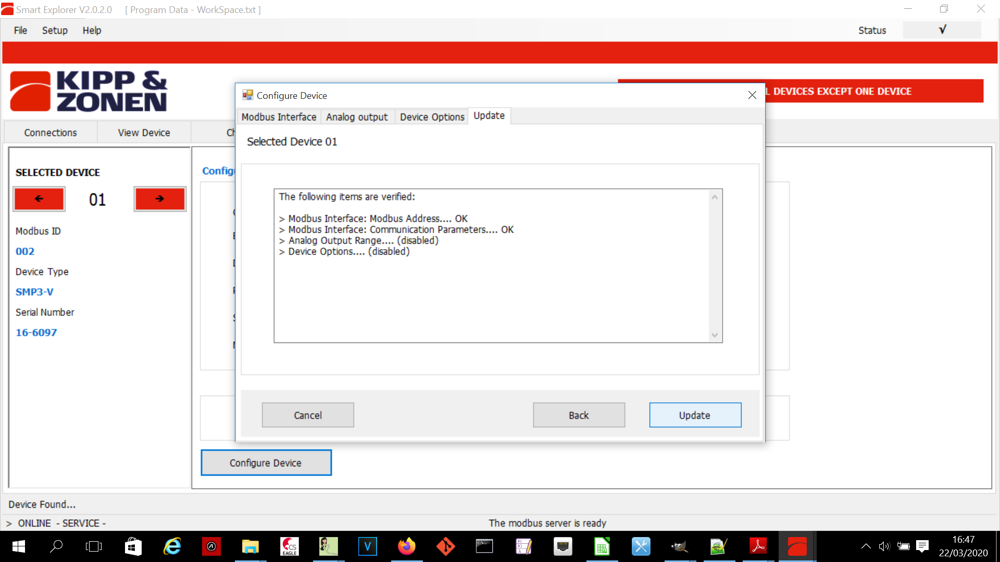
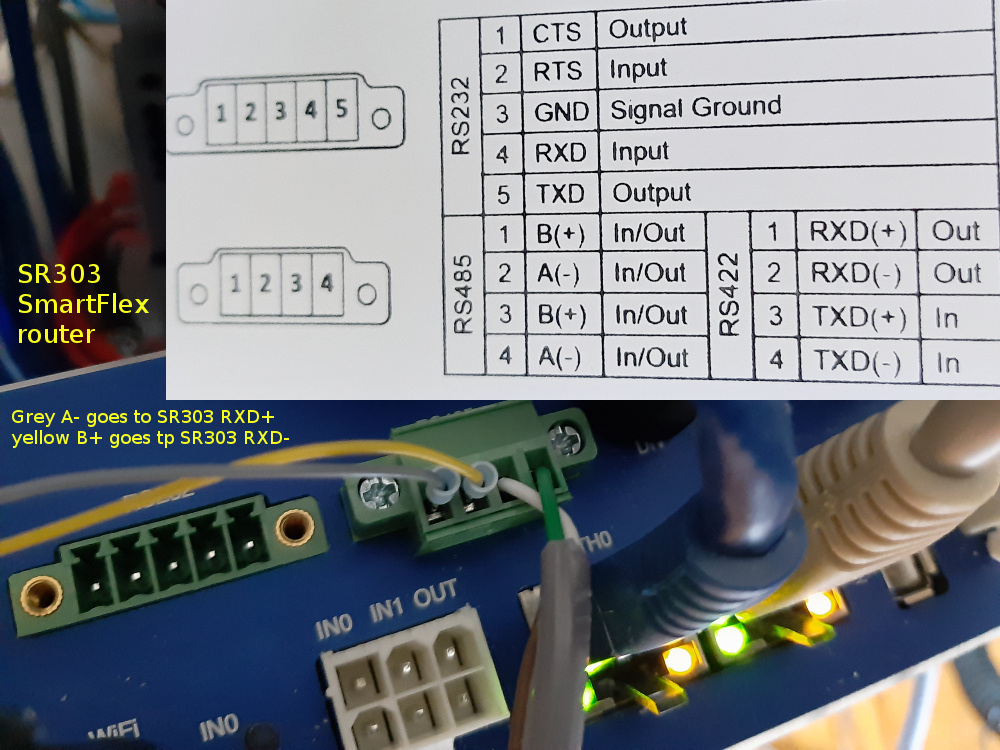

## Using a SMP3 pyranometer to monitor infrared radiation

The Kipp and Zonen [SMP3-V](https://www.kippzonen.com/Product/201/SMP3-Pyranometer#.XncyLCODM2w) measures the infrared radiation 
(from 300 to 3000 nm). It is a full modbus device.



### connection to a computer using a MOXA uport 1150

On a window desktop, go to the device manager and check that the Moxa works in RS485(2W)

The SMP comes with a 8-wire cable :
- 1 - red : Not used
- 2 - blue : MODBUS GND
- 3 - green : analogue out
- 4 - yellow : MODBUS B+
- 5 - grey - MODBUS A-
- 6 - brown : analogue ground
- 7 - white : VCC (12 ACDC)
- 8 - black : GROUND

Connect the SMP as follow :



Install the Kipp and Zonen Smart Explorer software, and connect to the device



### configuration for connection to the Themis RS485 bus

As the Enless radio receiver is the slave number 1 the Themis RS485 bus, we have to change the SMP3 modbus ID.
We can use the following settings :
- modbus ID : 2
- baudrate : 19200
- parity : None
- stop bits : 2

Please note that that factory configuration is :
- modbus ID : 1
- baudrate : 19200
- parity : even
- stop bits : 1

To fix the configuration in the SMP :
- change mode from normal network use to single instrument use
- go to the configuration tab
- press update







### Connection to the Themis RS485 bus



Adjust Emonhub configuration :
````
[[ModbusTCP]]
    Type = EmonModbusTcpInterfacer2
    [[[init_settings]]]
        modbus_IP = 192.168.2.1 # ip address of client to retrieve data from
        modbus_port = 503 # Portclient listens on
        fCode = 3 # optional if using function code 3 (read holding registers) - with fCode = 4, the interfacer will read input registers
    [[[runtimesettings]]]
        nodeIds = 23,24
        pubchannels = ToEmonCMS,
        # time in seconds between checks, This is in addition to emonhub_interfacer.run() sleep time of .01
        interval = 10
````
In our case, SMP3 is on node 24, whereas node 23 is a standard wireless TRH node 
````
[[24]]
    nodename = SMP3-V
    [[[rx]]]
       names = dev. type,model,net rad.,body temp.
       registers =1,2,7,9
       unitIds = 2
       datacode = H
       scale = 1

````

# modbus registers


|test|test|
|--------|--------|


| modbus_register| emonhub_register | parameter | Name | Description |
|--------|--------|--------|--------|--------|
| 0 | 1 | IO_DEVICE_TYPE | DevType | type of the sensor |
| 1 | 2 | IO_DATAMODEL_VERSION | DataSet | Version of the object data model |
| 2 | 3 | IO_OPERATIONAL_MODE | DevMode |Operational mode: normal, service, calibration and so on |
| 3 | 4 | IO_STATUS_FLAGS | Status | Device Status flags |
| 4 | 5 | IO_SCALE_FACTOR | Range | Range and scale factor sensor data (determines number of decimal places) |
| 5 | 6 | IO_SENSOR1_DATA | Sensor1 | Temperature compensated radiation in W/m2 (Net radiation for SGR) |
| 6 | 7 | IO_RAW_SENSOR1_DATA | RawData1 | Net radiation (sensor 1) in W/m2 |
| 7 | 8 | IO_STDEV_SENSOR1 | StDev1 | Standard deviation IO_SENSOR1_DATA |
| 8 | 9 | IO_BODY_TEMPERATURE | BodyTemp | temperature in 0.1 °C |
| 9 | 10 | IO_EXT_POWER_SENSOR | VSupply | External power voltage |
